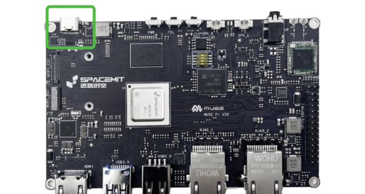

# K1_OH5.0系统调试说明

## 修订记录

| 修订版本 | 修订日期   | 修订说明                 |
|----------|------------|--------------------------|
| 001      | 2025-01-13 | 初始版本                 |
| 002      | 2025-04-11 | 添加MUSE Pi Pro          |
| 003      | 2025-07-17 | 添加cppcrash定位方法     |
| 004      | 2025-07-25 | 添加“打印堆栈”章节       |

## 1. 调试工具和方法

### 1.1 串口调试

系统默认支持串口调试，波特率为 **115200**。
通过串口可查看 **U-Boot**、**Kernel** 以及 **OpenHarmony init** 进程的相关日志输出。

#### 1.1.1 调整串口打印等级

##### 1.1.1.1 仅本次启动有效

串口中执行如下命令即可：

```bash
echo 8 > /proc/sys/kernel/printk
```

##### 1.1.1.2 持续生效

主要通过修改 `env_k1-x.txt` 文件中的 `loglevel` 值来实现，有 2 种方式：

1. 修改代码并编译固件

   - 修改 `device/board/spacemit/xxx/kernel/boot/bootfs/env_k1-x.txt` 中 `loglevel` 的值
   - 重新编译固件并烧录即可
2. 系统中直接修改，按照如下步骤进行：

   - 挂载内核

   ```bash
   # cd dev/block/
   # ls
   by-name  loop5         mmcblk2p1   mmcblk2p3  mmcblk2p9  ram12  ram4
   loop0    loop6         mmcblk2p10  mmcblk2p4  platform   ram13  ram5
   loop1    loop7         mmcblk2p11  mmcblk2p5  ram0       ram14  ram6
   loop2    mmcblk2       mmcblk2p12  mmcblk2p6  ram1       ram15  ram7
   loop3    mmcblk2boot0  mmcblk2p13  mmcblk2p7  ram10      ram2   ram8
   loop4    mmcblk2boot1  mmcblk2p2   mmcblk2p8  ram11      ram3   ram9
   #
   # mount mmcblk2p5 /tmp
   # cd /tmp
   # ls
   Image.itb  bianbu.bmp  env_k1-x.txt  k1-x_ZT001H.dtb  lost+found
   ```

   - 使用 `hdc` 工具拉取 `env_k1-x.txt`，修改后，再推入 `/tmp` 文件夹

   ```bash
   D:\>hdc file recv /tmp/env_k1-x.txt
   FileTransfer finish, Size:134 time:23ms rate:5.83kB/s

   D:\>hdc file send env_k1-x.txt /tmp/
   FileTransfer finish, Size:134, File count = 1, time:8ms rate:16.75kB/s
   ```

   - 取消挂载内核，重启即可生效

   ```
   # unmount /tmp
   # reboot
   ```

#### 1.1.2 串口连接方式

##### 1.1.2.1 MUSE Paper

MUSE Paper 可以通过 TF 卡口来引出串口，需要单独购买配件，如下：


将 TF 卡槽拿出来，将上面配件插入即可，上面配件的金手指朝向桌面。

##### 1.1.2.2 MUSE Pi & MUSE Card

MUSE Pi 和 MUSE Card 开发板上面有明显的串口连接标识 `（GND/RX/TX）`，按线序连接即可。

##### 1.1.2.3 MUSE Pi Pro


##### 1.1.2.4 MUSE Book


### 1.2 HDC

HDC（Harmony Device Connector）功能类似于 Android 的 ADB，支持 **USB** 和 **TCP** 两种连接模式。
在使用 TCP 模式时，默认端口为 **55555**。
配置文件路径：`device/board/spacemit/xxx/cfg/default.para`
示例如下：

```bash
persist.hdc.mode=usb,tcp
persist.hdc.port=55555
```

### 1.2.1 主机支持 HDC

#### 1.2.1.1 Windows 系统

Windows 系统将 `hdc.exe`（[点我下载](https://archive.spacemit.com/tools/openharmony/hdc.zip)）放在特定目录，并设置环境变量路径。

#### 1.2.1.2 Ubuntu 系统

- 安装依赖项‌：打开终端，输入以下命令来更新软件包列表并安装必要的开发工具和库

  ```bash
  sudo apt-get update
  sudo apt-get install build-essential libstdc++6 libc++1·
  ```
- 下载 HDC 工具包‌：前往 OpenHarmony 官网下载适用于 Linux 平台的最新版 HDC 工具压缩包。将其放置于合适位置后进行解压操作，请根据实际情况调整解压路径

  ```bash
  tar -zxvf hdc_std_<version>_linux.tar.gz -C /opt/hdc/
  ```
- 设置环境变量‌：编辑用户的 shell 初始化脚本（如 `.bashrc`），添加以下行至文件末尾：

  ```bash
  export PATH=$PATH:/opt/hdc/bin
  source ~/.bashrc
  ```
- 验证安装成功与否‌：在新的终端窗口里尝试运行简单的帮助指令以确认一切就绪，如果能够看到详细的帮助文档，则表明整个过程顺利完成

  ```bash
  hdc help
  ```

### 1.2.2 HDC 连接

#### 1.2.2.1 网络连接

需确保 HDC 的服务端和客户端在同一个局域网内，连接方式如下：

```bash
D:\>hdc tconn 10.0.90.142:55555
Connect OK

D:\>hdc shell
#
```

#### 1.2.2.2 USB 连接

```bash
D:\>hdc list targets
0123456789ABCDEF

D:\>hdc shell
#
```

#### 1.2.2.3 多设备连接

通过 `-t` 参数指定设备即可，如下：

```bash
D:\>hdc list targets
0123456789ABCDEF
ABCDEF

D:\>hdc -t 0123456789ABCDEF shell
#
```

### 1.2.3 HDC 常用命令

<table>
<tbody>
<tr>
<td>命令</td>
<td>用途</td>
</tr>
<tr>
<td>hdc list targets</td>
<td>查看当前所有设备</td>
</tr>
<tr>
<td>hdc shell reboot</td>
<td>重启</td>
</tr>
<tr>
<td>hdc uninstall com.example.myapp</td>
<td>卸载 hap 包</td>
</tr>
<tr>
<td>hdc install -r xxx.hap</td>
<td>重新安装 hap 包</td>
</tr>
<tr>
<td>hdc shell aa start -a EntryAbility -b com.example.myapp</td>
<td>启动 hap</td>
</tr>
<tr>
<td>hdc file recv  /xxx  D:/</td>
<td>从设备复制文件到本地</td>
</tr>
<tr>
<td>hdc file send  D:/xxx  /data/</td>
<td>发送本地文件到设备</td>
</tr>
<tr>
<td>hdc start -r</td>
<td>重启服务端</td>
</tr>
</tbody>
</table>

### 1.2.4 各设备的 hdc 连接口

#### 1.2.4.1 MUSE Paper & MUSE Paper 2


#### 1.2.4.2 MUSE Pi



#### 1.2.4.3 MUSE Card


#### 1.2.4.4 MUSE Book


#### 1.2.4.5 MUSE Pi Pro


### 1.3 hilog

#### 1.3.1. 基本使用方法

hilog 是 OpenHarmony 的日志系统，功能类似于 Android 的 **logcat**，用于查看和管理系统日志。基本使用方法如下：

```bash
hilog
hilog -r
```

#### 1.3.2 常用命令

<table>
<tbody>
<tr>
<td>命令</td>
<td>用途</td>
<td>示例</td>
</tr>
<tr>
<td>hilog -h</td>
<td>获取帮助</td>
<td></td>
</tr>
<tr>
<td>hilog -t app|core|kmsg|init</td>
<td>- 阻塞式实时查询模块日志<br/>- 可以与其他参数同时使用</td>
<td>hilog -t core</td>
</tr>
<tr>
<td>hilog -t app|core|kmsg|init -x</td>
<td>- 非阻塞式实时查询模块日志<br/>- 可以与其他参数同时使用</td>
<td>hilog -t core -x</td>
</tr>
<tr>
<td>hilog -T &lt;tag&gt;</td>
<td>- 模块内指定 tag<br/>- 可以与其他参数一起使用</td>
<td>hilog -T Launcher_Default</td>
</tr>
<tr>
<td>hilog -L D|I|W|E|F</td>
<td>- 指定 level 查询<br/>- D=Debug, I=Info, W=Warning, E=Error, F=Fatal</td>
<td>hilog -L I</td>
</tr>
<tr>
<td>hilog -D &lt;domain&gt;<br/></td>
<td>- 日志的服务域，用于指定输出日志所对应的业务领域<br/>- 这是一个十六进制整数，范围从 0x0 到 0xFFFFF。<br/>- 建议使用 0xAAABB 格式，AAA 表示子系统，BB 表示模块<br/>- 指定 domian 查询<br/>- 可以与其他参数一起使用</td>
<td>hilog -D 0x0<br/></td>
</tr>
<tr>
<td>^</td>
<td>- 排除</td>
<td>hilog -t ^app -T ^BatteryThread</td>
</tr>
</tbody>
</table>

#### 1.3.3 日志落盘

日志落盘是指将日志保存到文件中，方便后续导出和分析。

<table>
<tbody>
<tr>
<td>命令</td>
<td>用途</td>
</tr>
<tr>
<td>hilog -w start [-f "xxx"] [-l &lt;length&gt;] [-j &lt;jobid&gt;] [-m &lt;algorithm&gt;] [-n &lt;number&gt;]</td>
<td>启动落盘任务</td>
</tr>
<tr>
<td>hilog -w query [-j &lt;jobid&gt;]</td>
<td>查询落盘任务</td>
</tr>
<tr>
<td>hilog -w stop [-j &lt;jobid&gt;]</td>
<td>停止落盘任务</td>
</tr>
</tbody>
</table>

示例如下：

```bash
# hilog -w query
#
#hilog -w start -f "hilog" -l 66k -j 222 -m zlib -n 2                          
Persist task [jobid:222] started successfully
#cd /data/log/hilog
# ls -al
total 100
drwxr-x--- 2 logd   log     4096 1970-01-02 03:34 .
drwxrwx--- 6 system log     4096 1970-01-01 00:38 ..
-rw-r----- 1 logd   system 65540 1970-01-02 03:34 .persisterInfo_222
-rw-r----- 1 logd   system   132 1970-01-02 03:34 .persisterInfo_222.info
-rw-r----- 1 logd   system 12239 1970-01-02 03:34 hilog.002.19700102-033431.gz
-rw-r----- 1 logd   system  6883 1970-01-02 03:34 hilog.003.19700102-033431.gz
#
# hilog -w query -j 222 #指定jobid查询
222 core,app zlib /data/log/hilog/hilog 67584 2
#
# hilog -w query    #查询全部落盘任务
222 core,app zlib /data/log/hilog/hilog 67584 2
#
# hilog -w stop -j 222
Persist task [jobid:222] stopped successfully
#
# ls -al
total 36
drwxr-x--- 2 logd   log     4096 1970-01-02 03:35 .
drwxrwx--- 6 system log     4096 1970-01-01 00:38 ..
-rw-r----- 1 logd   system 12239 1970-01-02 03:34 hilog.002.19700102-033431.gz
-rw-r----- 1 logd   system 13000 1970-01-02 03:35 hilog.003.19700102-033431.gz
```

### 1.4 hidumper

hidumper 是 OpenHarmony 中为开发、测试人员，IDE 工具提供统一的系统信息获取工具，帮助使用者分析，定位问题。

<table>
<tbody>
<tr>
<td>命令</td>
<td>用途</td>
</tr>
<tr>
<td>hidumper -h</td>
<td>获取帮助</td>
</tr>
<tr>
<td>hidumper --cpuusage [pid]</td>
<td>查看某个进程的 CPU 占用信息</td>
</tr>
<tr>
<td>hidumper --mem [pid]</td>
<td>查看某个进程的内存占用情况</td>
</tr>
<tr>
<td>hidumper  --cpufreq</td>
<td>查看 CPU 的频率</td>
</tr>
<tr>
<td>hidumper --storage</td>
<td>查看存储情况</td>
</tr>
<tr>
<td>hidumper --net</td>
<td>查看网络情况</td>
</tr>
</tbody>
</table>

### 1.5 参数管理

<table>
<tbody>
<tr>
<td>命令</td>
<td>用途</td>
</tr>
<tr>
<td>param -h</td>
<td>获取帮助</td>
</tr>
<tr>
<td>param ls -r</td>
<td>查看所用系统参数</td>
</tr>
<tr>
<td>param ls -r persist.sys.hilog.debug.on</td>
<td>查看系统参数</td>
</tr>
<tr>
<td>param get persist.sys.hilog.debug.on</td>
<td>获取系统参数</td>
</tr>
<tr>
<td>param set persist.sys.hilog.debug.on true</td>
<td>设置系统参数</td>
</tr>
</tbody>
</table>

### 1.6 模拟按键

#### 1.6.1 鼠标操作

```bash
# uinput -?
Usage: uinput <option> <command> <arg>...
The option are:
-M  --mouse
commands for mouse:
-m <dx> <dy>              --move   <dx> <dy>  -move to relative position (dx,dy),
   <dx1> <dy1> <dx2> <dy2> [smooth time] --trace -dx1 dy1 to dx2 dy2 smooth movement
-d <key>                  --down   key        -press down a button,
                                               0 is the left button, 1 is the right,
                                               2 is the middle
-u <key>                  --up     <key>      -release a button
-c <key>                  --click  <key>      -press the left button down,then raise
-b <dx1> <dy1> <id> [press time] [click interval time]                --double click
  [press time] the time range is more than 1ms but less than 300ms,
  [click interval time] the time range is more than 1ms but less than 450ms,
  Otherwise the operation result may produce error or invalid operation
 -press the left button down,then raise
   key value:0 - button left
   key value:1 - button right
   key value:2 - button middle
   key value:3 - button side
   key value:4 - button extra
   key value:5 - button forward
   key value:6 - button back
   key value:7 - button task
-s <key>                  --scroll <key>      -positive values are sliding backwards
-g <dx1> <dy1> <dx2> <dy2> [total time]       --drag <dx1> <dy1> <dx2> <dy2> [total time],
                                              dx1 dy1 to dx2 dy2 smooth drag
-i <time>                 --interval <time>   -the program interval for the (time) milliseconds
                                               negative values are sliding forwards
```

##### 1.6.1.1 命令示例

<table>
<tbody>
<tr>
<td>命令</td>
<td>用途</td>
</tr>
<tr>
<td>uinput -M -m 50 50</td>
<td>鼠标光标移动到（50,50）位置</td>
</tr>
<tr>
<td>Uinput -M -b 50 200 0 100 300</td>
<td>鼠标在（50,200）左键双击，点击事件 100ms，双击的间隔时间 300ms</td>
</tr>
</tbody>
</table>

#### 1.6.2 键盘操作

```bash
# uinput -?
Usage: uinput <option> <command> <arg>...
The option are:
-K  --keyboard
commands for keyboard:
-d <key>                   --down   <key>     -press down a key
-u <key>                   --up     <key>     -release a key
-l <key> [long press time] --long_press <key> [long press time] -press and hold the key
-i <time>                  --interval <time>  -the program interval for the (time) milliseconds
```

##### 1.6.2.1 按键值

<table>
<tbody>
<tr>
<td>Keys</td>
<td>keycode</td>
</tr>
<tr>
<td>KEYCODE_HOME</td>
<td>1</td>
</tr>
<tr>
<td>KEYCODE_BACK</td>
<td>2</td>
</tr>
<tr>
<td>KEYCODE_VOLUME_UP</td>
<td>16</td>
</tr>
<tr>
<td>KEYCODE_VOLUME_DOWN</td>
<td>17</td>
</tr>
<tr>
<td>KEYCODE_POWER</td>
<td>18</td>
</tr>
<tr>
<td>KEYCODE_VOLUME_MUTE</td>
<td>22</td>
</tr>
<tr>
<td>KEYCODE_DPAD_UP</td>
<td>2012</td>
</tr>
<tr>
<td>KEYCODE_DPAD_DOWN</td>
<td>2013</td>
</tr>
<tr>
<td>KEYCODE_DPAD_LEFT</td>
<td>2014</td>
</tr>
<tr>
<td>KEYCODE_DPAD_RIGHT</td>
<td>2015</td>
</tr>
<tr>
<td>KEYCODE_DPAD_CENTER</td>
<td>2016</td>
</tr>
<tr>
<td>KEYCODE_TAB</td>
<td>2049</td>
</tr>
</tbody>
</table>

##### 1.6.2.2 命令示例

<table>
<tbody>
<tr>
<td>命令</td>
<td>用途</td>
</tr>
<tr>
<td>uinput -K -d 1 -u 1</td>
<td>按 HOME 键返回主界面</td>
</tr>
<tr>
<td>uinput -K -d 1 -u 1</td>
<td>声音调大</td>
</tr>
</tbody>
</table>

#### 1.6.3 触屏操作

```bash
# uinput -?
Usage: uinput <option> <command> <arg>...
The option are:
-T  --touch
commands for touch:
-d <dx1> <dy1>             --down   <dx1> <dy1> -press down a position  dx1 dy1,
-u <dx1> <dy1>             --up     <dx1> <dy1> -release a position dx1 dy1,
-m <dx1> <dy1> <dx2> <dy2> [smooth time]      --smooth movement
   <dx1> <dy1> <dx2> <dy2> [smooth time]      -smooth movement,
                                              dx1 dy1 to dx2 dy2 smooth movement
-c <dx1> <dy1> [click interval]               -touch screen click dx1 dy1
```

##### 1.6.3.1 命令提示

待完善

### 1.7 服务管理

<table>
<tbody>
<tr>
<td>命令</td>
<td>用途</td>
</tr>
<tr>
<td>service_control start pulseaudio</td>
<td>启动 pulseaudio 服务</td>
</tr>
<tr>
<td>service_control stop pulseaudio</td>
<td>停止 pulseaudio 服务</td>
</tr>
</tbody>
</table>

### 1.8 hiperf

hiperf 使用指导

[https://device.harmonyos.com/cn/docs/documentation/guide/subsys-toolchain-hiperf-0000001186316470](https://device.harmonyos.com/cn/docs/documentation/guide/subsys-toolchain-hiperf-0000001186316470)

### 1.9 bytrace

通过 hdc 来获取 trace 的方法如下：

- 抓取 trace：

```bash
D:\>hdc shell
# param set const.security.developermode.state true
# param set persist.hdc.root 1
# echo > /sys/kernel/debug/tracing/trace
# echo 4096 > /sys/kernel/debug/tracing/saved_cmdlines_size
# bytrace -t 10 -b 4096 --overwrite ohos zimage zmedia zcamera zaudio ability distributeddatamgr graphic freq irq mdfs workq  mmc idle notification sync pagecache ace app > /mnt/mynewtrace.ftrace
# echo > /sys/kernel/debug/tracing/trace
# exit
D:\>hdc file recv /mnt/mynewtrace.ftrace
查看trace：
https://ui.perfetto.dev（科学上网）
```

查看 trace：

### 1.10 bootchart

使用方法：

- 抓数据

```bash
hdc shell begetctl bootchart enable
hdc shell reboot                                                         # 重启
...
重启完成后
...
hdc shell begetctl bootchart stop
hdc shell begetctl bootchart disable
进入到/data/service/el0/startup/init/文件夹下查看是否有如下文件：
header、proc_diskstats.log、proc_ps.log、proc_stat.log

在/data/service/el0/startup/init/目录下执行命令：tar -czf bootchart.tgz *  # 打包
hdc file recv /data/service/el0/startup/init/bootchart.tgz ./        # 导出
```

- 下载 bootchart.jar，[点我下载](https://archive.spacemit.com/tools/openharmony/bootchart.zip)
- 数据转图片，执行如下命名，会生成 `bootchart.png`

```bash
java -jar bootchart.jar bootchart.tgz
```

如果执行该命令报错，如下，需要升级本机 java 版本

```bash
D:\>java -jar bootchart.jar bootchart.tgz
Exception in thread "main" java.lang.UnsupportedClassVersionError: org/bootchart/Main has been compiled by a more recent version of the Java Runtime (class file version 55.0), this version of the Java Runtime only recognizes class file versions up to 52.0
        at java.lang.ClassLoader.defineClass1(Native Method)
        at java.lang.ClassLoader.defineClass(Unknown Source)
        at java.security.SecureClassLoader.defineClass(Unknown Source)
        at java.net.URLClassLoader.defineClass(Unknown Source)
        at java.net.URLClassLoader.access$100(Unknown Source)
        at java.net.URLClassLoader$1.run(Unknown Source)
        at java.net.URLClassLoader$1.run(Unknown Source)
        at java.security.AccessController.doPrivileged(Native Method)
        at java.net.URLClassLoader.findClass(Unknown Source)
        at java.lang.ClassLoader.loadClass(Unknown Source)
        at sun.misc.Launcher$AppClassLoader.loadClass(Unknown Source)
        at java.lang.ClassLoader.loadClass(Unknown Source)
        at sun.launcher.LauncherHelper.checkAndLoadMain(Unknown Source)
```

- 生成的 `bootchart.png` 如下：


### 1.11 wpa\_supplicant & wpa\_cli

```
使用方法：
1. 开启再关闭wifi
2. cd /vendor/bin/
3. ./wpa_supplicant -B -i wlan0 -c /data/service/el1/public/wifi/wpa_supplicant/wpa_supplicant.conf
4. ps -ef | grep wpa查看wpa_supplicant是否起来
5. /wpa_cli -p /data/service/el1/public/wifi/sockets/wpa
6. > scan
7. > scan_results
8. > add_network，返回一个ID
9. > set_network ID ssid "WIFI名称"
10. > set_network ID psk "WIFI密码"
11. > enable_network ID
```

### 1.12 snapshot\_display

```bash
param set const.security.developermode.state true
param set persist.hdc.root 1
snapshot_display -f /data/local/tmp/test1.jpeg
```

### 1.13 wukong

待完善

### 1.14 power-shell

```bash
power-shell setmode 602      #性能模式，关闭休眠
power-shell suspend          #休眠
power-shell display -s xxx   #设置亮度
```

### 1.15 重新挂载 system/vendor 分区为可读写

system/vendor 分区默认挂载为只读（`ro`），当调试的时候需要使用 `hdc file send` 推文件的时候，需要将其重新挂载为可读写，如下：

```bash
mount -o remount,rw /vendor
mount -o remount,rw /
```

系统重启后失效，需要重新挂载

### 1.16 gdb 调试

待添加

### 1.17 调频

#### 1.17.1 CPU 频率

```bash
cd /sys/devices/system/cpu/cpufreq/policy0/

cat scaling_cur_freq
# 查看当前频率

cat scaling_available_frequencies
# 查看可用频率

echo userspace > scaling_governor
echo 1228800 > scaling_setspeed
# 调整频率

cat scaling_cur_freq
# 查看调整是否生效
```

#### 1.17.2 DDR 调频

```bash
# 频率表：
# 2400M C
# 1600M A
# 1200M 8
# 800M  4
# 600M  2

devmem 0xd4282980 4
# 读取当前频率

devmem 0xd4282980 4 0xX
# 设置频率，0xX值要比频率表的值+1，相当于bit0写1
# 比如设置2400M，devmem 0xd4282980 32 0xD
```

#### 1.17.3 EMMC 调频

待添加

## 2. 常用测试方法

### 2.1 monkey 测试

#### 2.1.1 环境配置（Windows）

1. 安装 **Python 3.8** 或更高版本及相关库。
2. 安装 `hdc` 设备链接工具并配置环境变量，保证 `cmd` 命令窗口中可以执行 `hdc shell` 或者 `hdc_std shell` 正确链接测试设备
3. 下载 `stablility_test_tool_v1.0` 这个 Python 测试工具包

#### 2.1.2 执行测试

```bash
D:\stablility_test_tool_v1.0>python.exe D:\stablility_test_tool_v1.0\monkey_test.py -d H1241200045 -p hdc -i 1000 -t 1000
```

参数说明：

- -d：测试设备的 SN 序列号，可通过 `hdc list targets` 查询
- -p：HDC 工具路径，可能为 `hdc` 或 `hdc_std`，根据配置的环境变量修改。
- -i：操作间隔时间（单位：ms）。建议设置为 **500ms**。若硬件性能较低，不建议设置过短，以免系统压力过大。
- -t：测试持续时间（单位：分钟）

### 2.2 循环 reboot

#### 2.2.1 环境配置（Windows）

1. 安装 **Python 3.8** 或更高版本及相关库。
2. 安装 `hdc` 设备链接工具并配置环境变量，保证 `cmd` 命令窗口中可以执行 `hdc shell` 或者 `hdc_std shell` 正确链接测试设备
3. 下载 `stablility_test_tool_v1.0` 这个 Python 测试工具包

#### 2.2.2 执行测试

```bash
D:\stablility_test_tool_v1.0>python.exe D:\stablility_test_tool_v1.0\reboot_test.py -d H1241200045 -p hdc -c 2000
```

参数说明：

- -d：测试设备的 SN 序列号，可通过 `hdc list targets` 查询
- -p：HDC 工具路径，可能为 `hdc` 或 `hdc_std`，根据配置的环境变量修改。
- -c：开关机循环次数，默认 **600 次**。每次间隔约 **80 秒**，最大等待设备重启时间为 **300 秒**。若需修改两次重启之间的间隔时间，可调整脚本中的 `REBOOT_WAIT_TIME` 参数，但该值不得短于设备完整开机时间。

### 2.3 循环音乐播放

直接打开“音乐”即可，自动循环播放音乐。

### 2.4 循环视频播放

下载视频老化专用测试 hap（[在这里](https://archive.spacemit.com/tools/openharmony/hap/)），通过 hdc 安装

```bash
hdc install 视频老化测试.hap
```

安装完成后，直接点击 `Launcher` 桌面上的图标运行即可，会自动循环播放。

### 2.5 GPU 老化测试（glmark）

使用方法：

```bash
执行下面3条命令可运行glmark老化：
power-shell setmode 602
cd /system/bin
./glmark2-es2 --run-forever --size 720x720
```

### 2.6 CPU 占用率测试

#### 2.6.1 查看进程占用

```bash
busybox top -d 1
```

显示如下：

```
Mem: 2282216K used, 1500976K free, 201532K shrd, 25944K buff, 788888K cached
CPU: 19.7% usr  5.5% sys  0.0% nic 74.7% idle  0.0% io  0.0% irq  0.0% sirq
Load average: 4.00 3.21 2.99 5/1032 28162
  PID  PPID USER     STAT   VSZ %VSZ CPU %CPU COMMAND
17110   196 20010043 R<   4329m116.6   5 15.2 com.isrc.Aidraw
  553     1 graphics R<   2239m 60.3   2  6.2 /system/bin/render_service
  482     1 composer S<   2067m 55.7   5  1.8 composer_host           9 composer
  191     1 logd     S    2073m 55.8   4  0.2 /system/bin/hilogd
27453     2 root     IW       0  0.0   3  0.2 [kworker/u16:1-p]
  104     2 root     SWN      0  0.0   3  0.2 [pvr_defer_free]
27639     2 root     IW       0  0.0   3  0.2 [kworker/u16:4-p]
 1528     1 wifi     S    2166m 58.3   7  0.1 wifi_manager_service
  194     1 samgr    S    2090m 56.3   5  0.1 /system/bin/samgr
  491     1 foundati S<   2290m 61.7   7  0.0 foundation
  633     1 root     S    2194m 59.1   6  0.0 /system/bin/hdcd
28140  4848 root     R     2048  0.0   6  0.0 busybox top -d 5
  265     2 root     SW       0  0.0   5  0.0 [ksdioirqd/mmc1]
 1602   196 10009    S<   4156m112.0   7  0.0 {m.ohos.systemui} com.ohos.systemu
  197     1 hiview   S    2226m 60.0   2  0.0 /system/bin/hiview
  358     1 radio    S    2198m 59.2   1  0.0 telephony
  540     1 powermgr S<   2169m 58.4   7  0.0 powermgr
  362     1 net_mana S    2145m 57.8   2  0.0 netmanager
  518     1 sensor   S    2090m 56.3   5  0.0 sensors
 1444     1 hidumper S    2085m 56.2   0  0.0 hidumper_service
```

#### 2.6.2 查看线程占用

```bash
busybox top -d 1 -H
```

显示如下：

```bash
Mem: 2283100K used, 1500092K free, 201532K shrd, 26020K buff, 788928K cached
CPU: 20.0% usr  6.1% sys  0.0% nic 73.8% idle  0.0% io  0.0% irq  0.0% sirq
Load average: 4.71 3.78 3.22 1/1028 28553
  PID  PPID USER     STAT   VSZ %VSZ CPU %CPU COMMAND
17110   196 20010043 S<   4337m116.9   1  8.5 com.isrc.Aidraw
17147   196 20010043 S<   4337m116.9   3  7.0 {RSRenderThread} com.isrc.Aidraw
  553     1 graphics S<   2239m 60.3   7  4.9 /system/bin/render_service
  521     1 composer S<   2067m 55.7   6  1.6 {OS_IPC_1_521} composer_host
22641     1 graphics S<   2239m 60.3   1  0.6 /system/bin/render_service
  962     1 graphics S<   2239m 60.3   5  0.4 {OS_IPC_3_962} /system/bin/render_
 1914     1 graphics S<   2239m 60.3   3  0.3 {OS_IPC_5_1914} /system/bin/render
  200     1 logd     S    2073m 55.8   5  0.2 {hilogd.server} /system/bin/hilogd
27639     2 root     IW       0  0.0   0  0.2 [kworker/u16:4-e]
  104     2 root     SWN      0  0.0   5  0.2 [pvr_defer_free]
27453     2 root     IW       0  0.0   5  0.2 [kworker/u16:1-e]
  840     1 composer S<   2067m 55.7   7  0.1 {OS_IPC_1_521} composer_host
17162   196 20010043 S<   4337m116.9   2  0.1 {RSRenderThread} com.isrc.Aidraw
17163   196 20010043 S<   4337m116.9   2  0.1 {RSRenderThread} com.isrc.Aidraw
  843     1 graphics S<   2239m 60.3   6  0.1 {VSyncGenerator} /system/bin/rende
18029     1 wifi     S    2166m 58.3   3  0.0 {OS_IPC_5_18029} wifi_manager_serv
 1579     1 wifi     S    2166m 58.3   2  0.0 {OS_IPC_2_1579} wifi_manager_servi
28522  4848 root     R     2180  0.0   5  0.0 busybox top -d 10 -H
  862     1 graphics S<   2239m 60.3   5  0.0 {RSBackgroundThr} /system/bin/rend
 1012     1 samgr    S    2090m 56.3   4  0.0 {OS_IPC_5_1012} /system/bin/samgr

```

#### 2.6.3 查看每个 CPU 的占用

```bash
busybox top -d 1
出现结果后再按1
```

显示如下：

```
Mem: 2283348K used, 1499844K free, 201532K shrd, 26124K buff, 788948K cached
CPU0:  0.0% usr  0.0% sys  0.0% nic  100% idle  0.0% io  0.0% irq  0.0% sirq
CPU1:  0.0% usr  0.0% sys  0.0% nic  100% idle  0.0% io  0.0% irq  0.0% sirq
CPU2:  0.0% usr  0.0% sys  0.0% nic  100% idle  0.0% io  0.0% irq  0.0% sirq
CPU3: 83.3% usr  0.0% sys  0.0% nic 16.6% idle  0.0% io  0.0% irq  0.0% sirq
CPU4: 85.7% usr 14.2% sys  0.0% nic  0.0% idle  0.0% io  0.0% irq  0.0% sirq
CPU5: 50.0% usr 12.5% sys  0.0% nic 37.5% idle  0.0% io  0.0% irq  0.0% sirq
CPU6: 12.5% usr 12.5% sys  0.0% nic 75.0% idle  0.0% io  0.0% irq  0.0% sirq
CPU7:  0.0% usr 42.8% sys  0.0% nic 57.1% idle  0.0% io  0.0% irq  0.0% sirq
Load average: 4.66 4.04 3.37 5/1038 28867
  PID  PPID USER     STAT   VSZ %VSZ CPU %CPU COMMAND
17110   196 20010043 R<   4337m116.9   3 24.8 com.isrc.Aidraw
  553     1 graphics R<   2239m 60.3   5  9.8 /system/bin/render_service
  482     1 composer S<   2067m 55.7   5  2.8 composer_host           9 composer
 1528     1 wifi     S    2166m 58.3   7  0.4 wifi_manager_service
  191     1 logd     S    2073m 55.8   7  0.4 /system/bin/hilogd
28864  4848 root     R     2048  0.0   7  0.4 busybox top -d 10
27453     2 root     IW       0  0.0   7  0.4 [kworker/u16:1-p]
  358     1 radio    S    2198m 59.2   1  0.2 telephony
  194     1 samgr    S    2090m 56.3   5  0.2 /system/bin/samgr
  104     2 root     RWN      0  0.0   7  0.2 [pvr_defer_free]
27639     2 root     IW       0  0.0   7  0.2 [kworker/u16:4-p]
 1602   196 10009    S<   4164m112.2   1  0.0 {m.ohos.systemui} com.ohos.systemu
 1576   196 20010014 S<   4099m110.4   7  0.0 {m.ohos.launcher} com.ohos.launche
```

### 2.7 GPU 占用率测试

使用如下命令：

```bash
cat /sys/kernel/debug/pvr/status
```

显示如下：

```bash
# cat /sys/kernel/debug/pvr/status
Driver Status:   OK

Device ID: 0:128
Firmware Status: OK
Server Errors:   1
HWR Event Count: 0
CRR Event Count: 0
SLR Event Count: 0
WGP Error Count: 0
TRP Error Count: 0
FWF Event Count: 0
APM Event Count: 0
GPU Utilisation: 2%
                    VM0
2D    Utilisation:   0%
GEOM  Utilisation:   0%
3D    Utilisation:   2%
CDM   Utilisation:   0%
RAY   Utilisation:   0%
GEOM2 Utilisation:   0%
```

## 3. 常见问题调试手段

### 3.1 外设

#### 3.1.1 屏幕背光无法调节

- 通过查看和设置节点 `sys/class/backlight/backlight/brightness` 来确认驱动是否正常
- 如果设置上述节点亮度无变化，说明驱动存在问题，需要查驱动，重点查看背光对应的 PWM 是否正常工作
- 如果设置上述节点亮度有变化，说明是 OH 上层的问题，可以通过命令 `power-shell display -s xxx(100>xxx>0)` 来查看亮度是否有变化

### 3.2 系统

#### 3.2.1 替换内核

- 挂载内核，可替换 `Image.itb` 和 `k1-x_ZT001H.dtb`（注：`dtb` 文件，不同方案的名称不一样）

```bash
# cd dev/block/
# ls
by-name  loop5         mmcblk2p1   mmcblk2p3  mmcblk2p9  ram12  ram4
loop0    loop6         mmcblk2p10  mmcblk2p4  platform   ram13  ram5
loop1    loop7         mmcblk2p11  mmcblk2p5  ram0       ram14  ram6
loop2    mmcblk2       mmcblk2p12  mmcblk2p6  ram1       ram15  ram7
loop3    mmcblk2boot0  mmcblk2p13  mmcblk2p7  ram10      ram2   ram8
loop4    mmcblk2boot1  mmcblk2p2   mmcblk2p8  ram11      ram3   ram9
#
# mount mmcblk2p5 /tmp
# cd /tmp
# ls
Image.itb  bianbu.bmp  env_k1-x.txt  k1-x_ZT001H.dtb  lost+found
```

- 通过 `hdc` 将更新的内核或者 `dtb` 文件推入 `/tmp` 文件夹

```bash
D:\>hdc file send Image.itb /tmp/
D:\>hdc file send k1-x_ZT001H.dtb /tmp/
```

- 取消挂载内核，重启即可生效

```
# unmount /tmp
# reboot
```

#### 3.2.2 进入 U-Boot

有 2 种方法：

- 开机后，hdc 连接后或者串口连接后，执行 `reboot uboot`，重启后会进入 U-Boot
- 连接串口，关机后，串口输入按住 s 键，上电开机，进入 U-Boot

#### 3.2.3 cppcrash

##### 3.2.3.1 常规 cppcrash 处理方法

cppcrash 一般会在 `/data/log/faultlog/faultlogger/` 路径下生成 1 个 log，根据 log 中的堆栈来获得异常代码的函数及行数，来定位问题。

我们以带宽统计工具 ddr\_bw 为例子，手动造 1 个 cppcrash 来进行分析：

1. 修改 ddr\_bw 的代码如下：

   ```bash
   fuqiang@snode2:~/workspace/oh5_r_release/device/soc/spacemit$ git diff
   diff --git a/k1/tools/ddr_bw/BUILD.gn b/k1/tools/ddr_bw/BUILD.gn
   index 17dbd73..f7164bf 100755
   --- a/k1/tools/ddr_bw/BUILD.gn
   +++ b/k1/tools/ddr_bw/BUILD.gn
   @@ -6,6 +6,7 @@ cflags_c_common = [
      "-Wno-unused-function",
      "-Wno-pointer-to-int-cast",
      "-Wno-deprecated-non-prototype",
   +  "-O0",
    ]

    cflags_cc_common = [
   @@ -13,6 +14,7 @@ cflags_cc_common = [
      "-Wno-unused-function",
      "-Wno-pointer-to-int-cast",
      "-Wno-deprecated-non-prototype",
   +  "-O0",
    ]

    ohos_executable("ddr_bw") {
   diff --git a/k1/tools/ddr_bw/ddr_bw.c b/k1/tools/ddr_bw/ddr_bw.c
   index 7469da8..51d4167 100644
   --- a/k1/tools/ddr_bw/ddr_bw.c
   +++ b/k1/tools/ddr_bw/ddr_bw.c
   @@ -217,6 +217,8 @@ int main(int argc, char **argv)
           unsigned int poll_time = 3000;
           unsigned int mid = -1;
           OPTION_CHOICE o;
   +       char *ptr = NULL;
   +       *ptr = 'a';

           int fd = open("/dev/ddr_bw", O_RDWR);
           if (fd < 0) {

   ```

   - 添加 `-O0` 参数：去除编译器优化
   - 添加空指针代码，产生异常
2. 编译 ddr\_bw 并将 ddr\_bw 推入到机器中，执行 ddr\_bw，产生 signal，如下：

   ```bash
   # ddr_bw -h
   Signal 11

   ```
3. 在 `/data/log/faultlog/faultlogger/` 中会生成 log，如下：

   ```bash
   # cd /data/log/faultlog/faultlogger/
   # ls
   cppcrash-ddr_bw-0-20250717120106
   #
   ```
4. 查看 log 中的堆栈：

   ```
   #00 pc 0000000000002648 /system/bin/ddr_bw(main+112)(ccc496b897ea8db5a3329975bcf3d228)
   #01 pc 0000000000081230 /system/lib/ld-musl-riscv64.so.1(libc_start_main_stage2+64)(eef0e3dc54310d303c9e0c2319c54537)
   #02 pc 0000000000001e60 /system/bin/ddr_bw(_start_c+70)(ccc496b897ea8db5a3329975bcf3d228)
   #03 pc 00000000000758cc /system/lib/ld-musl-riscv64.so.1(__dls3+7038)(eef0e3dc54310d303c9e0c2319c54537)

   ```
5. 通过 addr2line 工具定位异常代码的函数和行数，addr2line 工具的位置在：`prebuilts/ohos-sdk/linux/12/native/llvm/bin/llvm-addr2line`，定位到异常发生在 main 函数，`ddr_bw.c` 的 221 行

   ```bash
   fuqiang@snode2:~/workspace/oh5_r_release$ ./prebuilts/ohos-sdk/linux/12/native/llvm/bin/llvm-addr2line -e out/musepaper2/exe.unstripped/device_musepaper2/spacemit_products/ddr_bw -f 0x2648
   main
   /data/home/fuqiang/workspace/oh5_r_release/out/musepaper2/../../device/soc/spacemit/k1/tools/ddr_bw/ddr_bw.c:221
   ```
6. 查看代码发现，确实找到了之前故意添加的空指针代码位置。

   ```cpp
   210 int main(int argc, char **argv)
   211 {
   212         struct ddrbw_info *info;
   213         int ret;
   214         int all_info = 0;
   215         int ddr_only = 0;
   216         int list_req = 0;
   217         unsigned int poll_time = 3000;
   218         unsigned int mid = -1;
   219         OPTION_CHOICE o;
   220         char *ptr = NULL;
   221         *ptr = 'a';
   222
   223         int fd = open("/dev/ddr_bw", O_RDWR);
   224         if (fd < 0) {
   225                 printf("open file failed!\n");
   226                 return -1;
   227         }

   ```

#### 3.2.4 打印堆栈

在调试或者跟踪代码的时候，经常需要打印函数调用栈，可以通过调用 `printCallers` 接口来实现，具体的接口如下：

```cpp
#include <execinfo.h>
#include <stdio.h>
#include <stdlib.h>
#include <string.h>
#define MAX_FRAMES 20
void printCallers()
{
    int layers = 0, i = 0;
    char ** symbols = NULL;
    
    void * frames[MAX_FRAMES];
    memset(frames, 0, sizeof(frames));
    layers = backtrace(frames, MAX_FRAMES);
    for (i=0; i<layers; i++) {
        printf("Layer %d: %p\n", i, frames[i]);
    }
    printf("------------------\n");
    
    symbols = backtrace_symbols(frames, layers);
    if (symbols) {
        for (i=0; i<layers; i++) {
            printf("SYMBOL layer %d: %s\n", i, symbols[i]);
        }
         free(symbols);
    }
    else {
        printf("Failed to parse function names\n");
    }
}
```

将上面的接口放入要打印堆栈的文件中，调用 `printCallers` 进行打印即可。

打印效果如下：


### 3.3 休眠唤醒异常

#### 3.3.1 只关屏，无法深度休眠

- 查看 `vendor/spacemit/xxx/power_config/power_mode_config.xml` 是否设置了禁止深度休眠，具体参考 K1 OH5.0 系统定制说明 的 电源管理定制 章节
- 通过 `power-shell dump -a` 查看系统是否拿了禁止休眠的
- 查看 hilog 和内核 log 是否有异常打印

#### 3.3.2 深度休眠失败

待补充

#### 3.3.3 深度休眠后唤醒失败

查看唤醒源，分析是谁唤醒了系统

```bash
cat /sys/kernel/debug/wakeup_sources
```

打开调试 log

```bash
echo 9 > /proc/sys/kernel/printk
echo N > /sys/module/printk/parameters/console_suspend
```

内核级休眠命令

```bash
echo +20 > /sys/class/rtc/rtc0/wakealarm
echo mem > /sys/power/state
```

OH 系统级休眠命令

```bash
power-shell suspend
```
