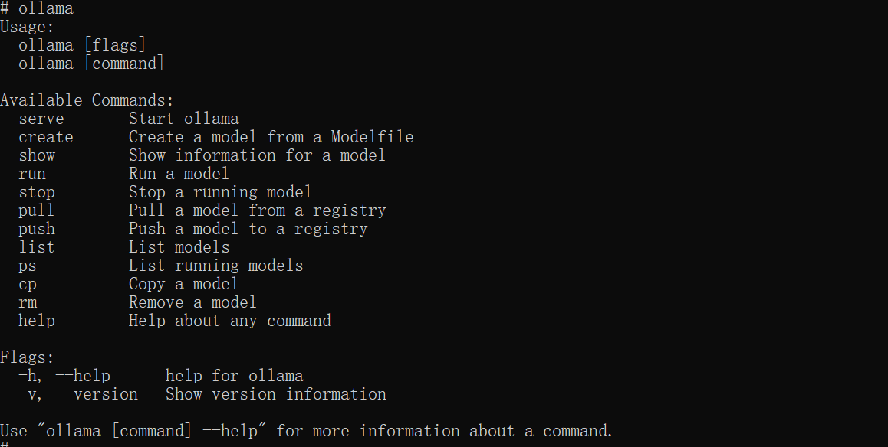
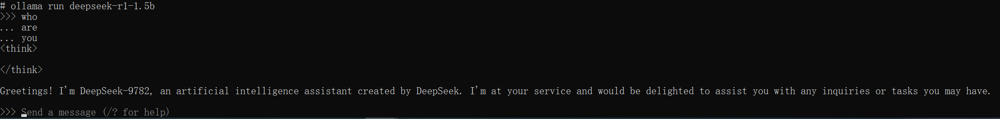
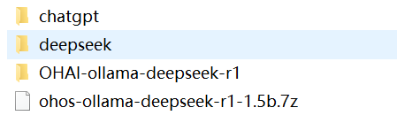
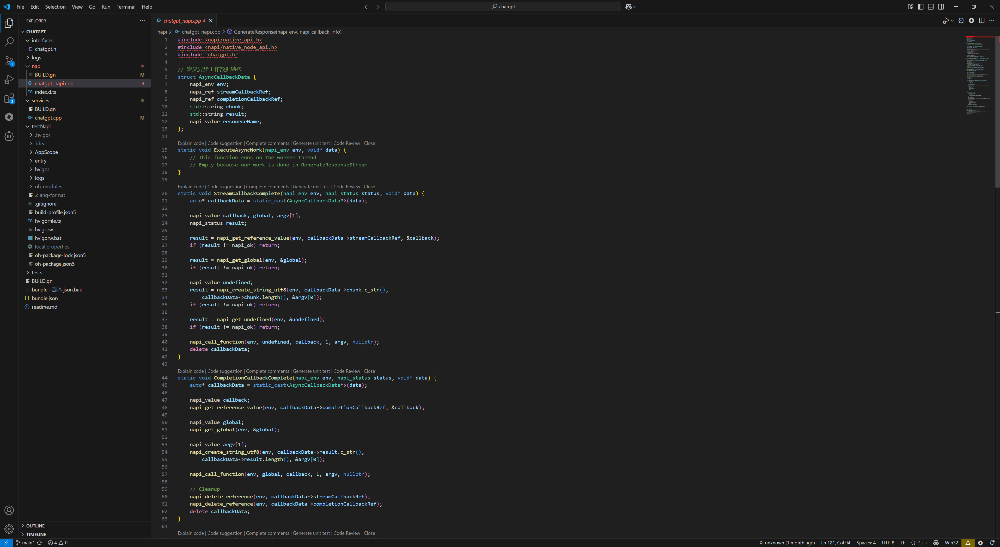
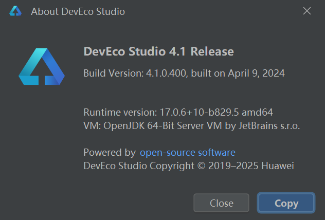
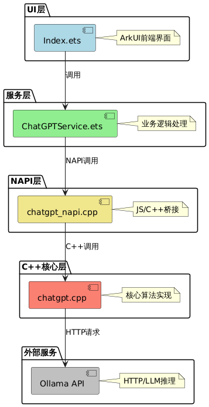
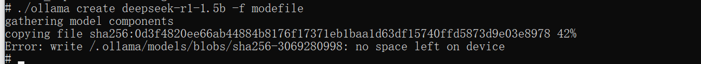

# K1_OH5.0 AI 构建开发说明

## 修订记录

| 修订版本 | 修订日期   | 修订说明 |
|----------|------------|----------|
| 001      | 2025-03-28 | 初始版本 |
| 002      | 2025-04-12 | 优化格式 |

## 1. 前置准备

参考编译文档完成系统编译、烧录：[K1 OH5.0 下载编译烧录说明](2_K1_OH5.0_build_flash.md)

### 1.1 Ollama + Deepseek 资源准备

下载地址：[点我下载](https://archive.spacemit.com/tools/openharmony/ai/)

```
deepseek-r1-distill-qwen-1.5b-q4_0.gguf
Modelfile
Ollama
```

#### deepSeek-r1-distill-qwen-1.5b-q4\_0.gguf

已压缩与优化的大语言模型文件，采用 **GGUF** 格式。该格式针对高效推理与模型压缩设计，适合在资源受限的设备（如嵌入式或移动终端）上运行。

#### Modefile

定义了如何配置和使用 `deepseek-r1-distill-qwen-1.5b-q4_0.gguf` 模型文件。

#### Ollama

运行和管理各种机器学习模型。它支持多个模型版本和格式，包括 `DeepSeek` 系列模型。通过 `Ollama`，你可以方便地部署、运行和管理 `DeepSeek-R1-Distill-Qwen-1.5B-Q4_0.gguf` 模型。

### 1.2 环境和工具准备

1. MUSE Paper 及电源一套
2. Type-C 线（用于烧录和 hdc 连接）
3. Windows 系统端安装 hdc 工具（用于和板子之间传输文件）
4. IDE（DevEco 4.0）
5. K1 OH5.0 编译构建环境

## 2. 安装 Ollama + deepseek-r1-1.5b

为了让开发者快速体验，提供了一键打包安装的安装包。

### 2.1 连接设备

用 Type-C 线连接 Windows 系统和 Muse Paper

确认 `hdc shell` 正常连接 MUSE Paper

```bash
D:\>hdc list targets
0123456789ABCDEF
```

### 2.2 下载并解压安装包

将安装包下载至 Windows 电脑任意目录并解压。下载地址：[点我下载](https://archive.spacemit.com/tools/openharmony/ai/)（若已下载，请忽略）。

安装包内包含：安装包、二次开发所需要的程序和开发手册等。

#### 2.2.1. 一键自动安装 Deepseek

双击图中的红色圈住的安装脚本：`setup_ohos_ollama_env_v1.0.bat `， 系统将自动为 OH 安装所有 LLM 的依赖库和应用程序:


#### 2.2.2. 运行调试

安装完后，应用就可以进行 LLM 的问答功能。

- 运行 Ollama，显示如下图表示 Ollama 正常工作：



- 如下图，若 `list` 为空，表示模型没有安装，需要加载大模型


- 加载大模型


- 再查看模型列表


- 在命令行运行大模型进行对话



- 打开 OH 的 HAP 程序


- 测试 HAP 的使用界面


## 3. 二次开发

### 3.1 开发环境准备

- OH 系统开发：VSCode + Ubuntu Linux server
- HAP 开发：DevEco 4.0 （推荐版本：`deveco-studio-4.1.0.400.exe`）
- 需要开发文件：[点我下载](https://archive.spacemit.com/tools/openharmony/ai/)（若已下载，请忽略）

  - `chatgpt`: 包含 OH ChatGPT 库代码与 TestNAPI 测试代码
  - `deepseek`: 演示 HAP 代码



### 3.2. OH 系统构建

- 将 `chatgpt` 文件夹放入路径：`oh5.0/foundation/communication/chatgpt`
- 配置模块编译文件后，即可生成对应库文件，为上层 HAP 提供访问 Ollama 接口的支持

#### 3.2.1. 编辑开发代码

根据实际需求修改源代码。



#### 3.2.2. 编译镜像

执行以下命令进行系统构建：

```bash
./build.sh --product-name musepaper2 --ccache --prebuilt-sdk
```

与本工程相关的两个库为：

- `libchatgpt_napi.z.so`
- `libchatgpt_core.z.so`

新编译的镜像包含这两个 so，可以烧录镜像，也可以用 `hdc file send` 命令推送进去，如下：

```bash
hdc file send libchatgpt_napi.z.so /lib64/module/
hdc file send libchatgpt_core.z.so /lib64/
```

### 3.3. HAP 测试工程

`OH5.0\foundation\communication\chatgpt\testNapi` 目录主要用于为二次开发者提供参考示例，以便其基于该工程开发自定义的 AI 大模型应用。使用指定版本的 DevEco Studio 打开并编译该工程，可生成测试用的 `testNapi` HAP 文件，用于验证功能及辅助后续 LLM 应用开发。



### 3.4 开发调试

#### 3.4.1 查看日志

1. `hdc shell higlog | grep Chatgpt`
2. `hdc shell hilog | grep Index`
3. 设置 Ollama debug：

   1. `export OLLAMA_DEBUG=1`    //可输出日志
   2. `e``xport OLLAMA_HOST='0.0.0.0'`  //可外部访问 OLLAMA

   ```
   02-28 12:35:58.260  4086  4086 I C01650/ChatGPT: ChatGPT instance created
   02-28 12:35:58.260  4086  4086 I C01650/ChatGPT: Generating streaming response for input: who are you
   02-28 12:35:58.261  4086  7595 I C01650/ChatGPT: Request payload: {"model":"deepseek-r1-1.5b","prompt":"who are you","stream":true}
   02-28 12:35:58.262  4086  7595 I C01650/ChatGPT: Making request to Ollama API at [http://localhost:11434/api/generate](http://localhost:11434/api/generate)
   02-28 12:35:58.266  4086  7595 I C01650/ChatGPT: CURL request completed after 1 attempts
   02-28 12:35:58.267  4086  7595 I C01650/ChatGPT: Request completed successfully
   ```

### 3.5 演示 HAP 工程

同样使用 DevEco Studio 4.1 Release 打开对应代码工程，编译演示 HAP。


## 4. OH + Ollama + Deepseek 设计说明

### 4.1. 架构

1. **前端层(ArkTS)**

   - 界面和业务
2. **服务层 (ArkTS)**

   - 跨 NAPI 回调实现 (ArkTS ↔ OS Native)
   - 回调注册和管理
   - 业务逻辑、API 交互和数据处理
3. **NAPI 层**

   - JavaScript/TypeScript 与 C++ 的接口
   - 参数解析和传递
   - 回调注册
4. **C++ 实现层**

   - 核心功能及本地 API 交互
   - `napi_async_work` 实现（防止主线程阻塞  导致 app 主线工作线程发生 block crash）;
   - 实现跨 napi 的 callback（ arkts \<---\> os native )
   - Ollama 集成
   - DeepSeek 集成

### 4.2. LLM(chatgpt) 子系统部件 **设计&实现**

- ChatGPTService 使用单例
- C++ ChatGPT 类使用单例
- 异步处理

  - NAPI 层使用 `napi_async_work`
  - C++ 层使用 `std::thread`
  - 智能指针防止内存泄漏，增加健壮性，替代 `new`
  - UI 层使用实时回调
  - 流式 stream 处理
  - 详细日志跟踪

### 4.2.1 调用流程

1. 用户在 UI 输入文本 → 触发 `onClick` 事件
2. `ChatGPTService` 调用 NAPI 模块的 `generateResponse`
3. NAPI 层转换参数，创建异步工作
4. C++ 层执行 HTTP 请求，通过回调返回结果
5. 结果通过回调链传回前端显示，前端实时渲染



### 4.2.2. chatgpt\_napi.cpp 设计

数据结构：

```cpp
struct AsyncCallbackData {
    napi_env env;                    // NAPI 环境
    napi_ref streamCallbackRef;      // 流式回调引用
    napi_ref completionCallbackRef;  // 完成回调引用
    std::string chunk;               // 数据块
    std::string result;              // 结果
    napi_value resourceName;         // 资源名称
};
```

回调处理

- `StreamCallbackComplete`：处理流式数据回调，当有数据 chunk 出现进行处理

  - 获取回调函数引用
  - 创建参数数组
  - 调用 JavaScript 回调函数
  - 清理资源
- `CompletionCallbackComplete`：处理完成回调，当处理完成回调处理

  - 类似流式回调的处理流程
  - 额外清理所有回调引用

**主要接口函数**

```cpp
napi_value GenerateResponse(napi_env env, napi_callback_info info) {
    // 获取参数
    // 创建回调引用
    // 设置异步工作
    // 调用本地方法
}
```

模块初始化

```cpp
napi_value Init(napi_env env, napi_value exports) {
    // 注册模块方法
    napi_property_descriptor desc[] = {
        { "generateResponse", nullptr, GenerateResponse, nullptr, nullptr, nullptr, 
            napi_default, nullptr }
    };
    napi_define_properties(env, exports, 1, desc);
    return exports;
}

NAPI_MODULE(chatgpt_napi, Init)
```

代码流程：

- 模块初始化

```cpp
NAPI_MODULE(chatgpt_napi, Init)  // 注册模块
↓
Init(napi_env env, napi_value exports)  // 初始化函数
↓
napi_define_properties  // 注册 generateResponse 方法

ChatGPT初始化：
ChatGPT::ChatGPT()
↓
std::call_once(initFlag, [this]() {
    InitializeCurl()  // CURL 全局初始化
})
```

UI 层触发：

```javascript
// Index.ets 中的点击事件
this.chatGPTService.generateResponseStream(
    this.userInput,
    (chunk: string) => { this.response += chunk },
    (result: string) => { this.isLoading = false }
)
```

- 服务层处理：

```javascript
// ChatGPTService.ets
public generateResponseStream(input: string, streamCallback, completionCallback): void {
    this.nativeChatGPT.generateResponse(input, streamCallback, completionCallback)
}
```

- NAPI 层转换：

```cpp
// chatgpt_napi.cpp
napi_value GenerateResponse(napi_env env, napi_callback_info info) {
    // 参数转换
    // 创建异步工作
    OHOS::Communication::ChatGPT::GetInstance().GenerateResponseStream(
        input, streamCallback, completionCallback);
}
```

- C++ 核心实现：

```cpp
// chatgpt.cpp
void ChatGPT::GenerateResponseStream(
    const std::string& input,
    StreamCallback streamCallback,
    CompletionCallback completionCallback) {
    // 执行 HTTP 请求
    // 处理流式响应
}
```

## 5. FAQ

### 5.1. 保证推理 CPU 资源不被强占，需要绑定消耗 CPU 的几个进程

```bash
taskset -p 240 $(pidof render_service) 
taskset -p 240 $(pidof com.example.deepseek) 
taskset -p 240 $(pidof com.example.testnapi) 

参数说明：
240 (十六进制0xf0 , 二进制 11110000) 表示 CPU 4-7
命令说明：
taskset -p 240 $(pidof render_service)
pidof render_service： 找到对应线程的线程ID（PID）
taskset -p 240 [PID] 绑定进程运行的CPU 240（二进制表示：11110000）

如果要产品化可以调用 sched_setaffinity() 函数来设置CPU的绑定
int sched_setaffinity(pid_t pid, size_t cpusetsize, const cpu_set_t *mask);
```

### 5.2. 如何导出 Ollama 日志

```bash
export OLLAMA_DEBUY=1
./ollama serve
```

### 5.3. MUSE Paper 经常熄屏

设置屏幕不熄屏

```bash
power-shell setmode 602
```

### 5.4. Ollama 无法运行

可能缺少了 `ld-linux-riscv64-lp64d.so.1`

```bash
/lib/ld-linux-riscv64-lp64d.so.1

把这个文件拷贝的ohos的对应目录, 赋予执行权限 chmod +x /lib/ld-linux-riscv64-lp64d.so.1
```

### 5.5. 空间不够



解决方法： 把这个 /.ollama 目录链接到 /data/deepseek/.ollama

```bash
ln -s /data/deepseek/.ollama /.ollama
```

### 5.6. Windows 命令行下面法输入中文和显示中文调试

```
设置CMD支持中文<: 在windows console 执行>
  让CMD Console支持中文输入与显示：
  chcp 65001:
  
chcp 是 “Change Code Page” 的缩写，用于更改当前控制台的代码页。65001 代表 UTF - 8 编码。
执行此命令后，CMD 窗口会切换到 UTF - 8 编码，此时就能正常显示和输入中文了。 
```
