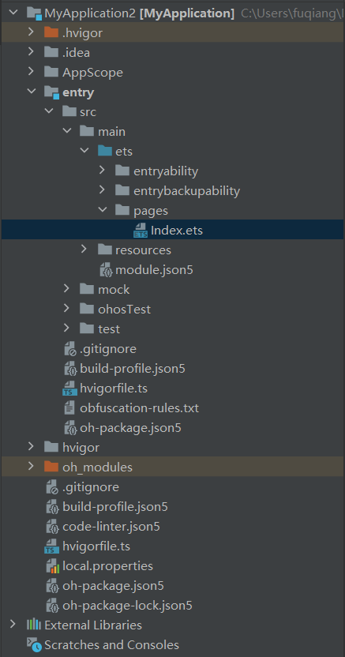
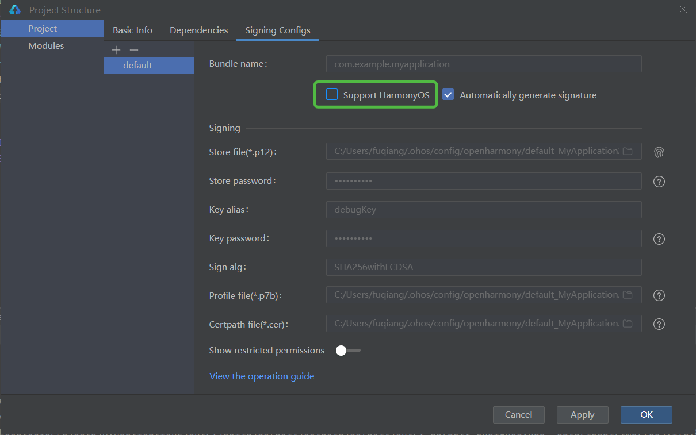
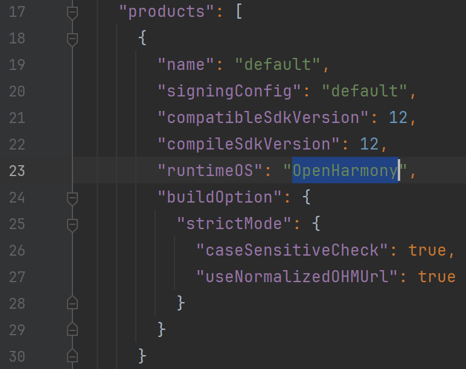
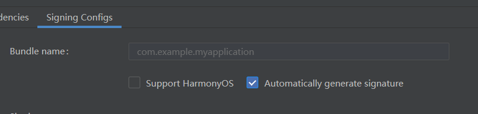

sidebar_position: 6

# K1_OH5.0应用开发说明

## 修订记录

| 修订版本 | 修订日期   | 修订说明     |
|----------|------------|--------------|
| 001      | 2025-06-10 | 初始版本     |
| 002      | 2025-07-25 | 添加一些FAQ  |

## 1. OpenHarmony 应用开发概述

### 1.1 ArkTS

ArkTS 是鸿蒙（HarmonyOS/OpenHarmony）生态的官方主力应用开发语言，基于 TypeScript（TS）扩展而来，是 TS 的超集扩展，继承 TypeScript 语法风格，强化静态类型检查（编译时检测错误，提升代码健壮性），兼容 JS/TS 生态，支持高效互操作，降低迁移门槛。

#### 1.1.1 核心技术特性

- 声明式 UI 开发范式

  - 通过装饰器（如 `@Entry`、`@Component`）定义组件，以简洁的声明式语法构建界面逻辑
  - 提供状态管理（如 `@State`），驱动数据变化自动更新 UI
- 分布式与并发增强

  - 优化并发编程 API，支持多线程任务调度（如 Taskpool 机制），提升跨设备协同性能
  - 为“一次开发，多端部署”提供底层支持，适配手机、平板、车机等全场景设备
- 性能与稳定性优化

  - 静态类型约束减少运行时类型检查，提高执行效率
  - 强制属性显式初始化（如类成员变量），避免未定义错误导致的运行时崩溃

### 1.2. ArkUI

ArkUI（方舟 UI 框架）是华为为 HarmonyOS/OpenHarmony 生态系统构建的声明式 UI 开发框架，专注于实现高效、高性能的跨设备应用界面开发。基于 ArkTS 语言扩展（TypeScript 超集），通过组件化、状态驱动等机制简化 UI 构建逻辑，提供极简的 UI 语法（如装饰器 `@Component`），开发者通过声明式描述界面结构而非命令式操作。


#### 1.2.1. 核心技术特性

- 高性能渲染架构

  - 优化 UI 更新机制：将 Diff 算法从树形结构对比升级为单节点函数式更新，大幅提升渲染效率
  - 统一渲染引擎保障流畅动效，减少主线程卡顿
- 逻辑与 UI 解耦

  - 通过数据双向绑定简化状态管理，跨端开发代码量减少 40% 以上
  - 支持状态管理（如 `@State`、`@Link`），实现数据变化自动驱动 UI 刷新
- 多形态组件库

  - 提供丰富内置组件（文本、按钮、列表等）及布局能力，覆盖基础界面到复杂交互场景
  - 支持自定义组件开发，满足业务定制化需求

### 1.3 Ark 运行时（方舟运行时）

Ark 运行时（又称方舟运行时）是 HarmonyOS/OpenHarmony 生态中支撑 ArkTS/JS/TS 语言执行的核心引擎，负责字节码运行、内存管理及跨语言互调等关键能力。

#### 1.3.1 核心架构组成

- 核心子系统（Core Subsystem）

  - 提供基础运行库，支撑字节码文件解析（File 组件）、调试工具链（Tooling 组件）及系统调用适配（Base 库）
- 执行子系统（Execution Subsystem）

  - 包含字节码解释器、内联缓存优化机制，实现高效执行方舟字节码（`.abc` 文件）
- 编译器子系统（Compiler Subsystem）

  - 支持 AOT（预编译优化）、JIT（动态编译实验阶段）及基于 IR 的编译框架，提升代码执行效率
- 运行时子系统（Runtime Subsystem）

  - 内存管理‌：CMS-GC 垃圾回收器实现并发标记与部分内存压缩
  - 跨语言接口‌：通过 Node-AP I 支持 TS/JS/C++ 等多语言混合开发

#### 1.3.2 关键技术特性

- 多模式执行引擎

  - 同时支持解释执行、‌AOT 预编译及实验性 JIT 动态编译‌，平衡启动速度与运行效率
- 高性能内存管理

  - 采用并行标记的 CMS-GC 算法，减少暂停时间；支持部分内存压缩，优化内存碎片
- 分布式调试支持

  - 内置 Debugger 工具链，实现跨设备协同开发时的实时诊断与性能分析
- 标准库兼容性

  - 完整实现 ECMAScript 规范，提供高效容器库（如 Map/Set），保障 JS/TS 生态兼容

## 2. 开发环境搭建（windows）

### 2.1 DevEco Studio 安装配置

- 下载工具：[点我下载 DevEcoStudio5.0.5.310](https://archive.spacemit.com/tools/openharmony/devecostudio-windows-5.0.5.310.zip)，DevEco Studio 是开发 OpenHarmony 应用程序的专用 IDE
- 双击下载的 `deveco-studio-xxxx.exe`，进入 DevEco Studio 安装向导，默认安装于 `C:\Program Files` 路径下，也可以安装到指定位置（注意：不要出现中文或特殊字符），然后单击 `NEXT`

### 2.2 SDK 工具链配置

OpenHarmony 的 SDK 是专为 OpenHarmony 系统设计的软件开发工具包，它能够提供开发原生应用所需的基础能力和工具集。所以，我们需要下载并且配置好 SDK 才能够进行应用开发。

#### 2.2.1 Public SDK 与 Full SDK

在 OpenHarmony 中，`Public SDK` 与 `Full SDK` 是面向不同开发场景的工具包，其核心差异如下：

- API 权限

<table>
<tbody>
<tr>
<td>类型</td>
<td>权限说明</td>
</tr>
<tr>
<td>Public SDK</td>
<td>提供给普通应用开发者使用，仅包含开放API‌，不涉及系统敏感权限（如@ohos.app.ability.abilityManager、蓝牙控制等高权限接口）</td>
</tr>
<tr>
<td>Full SDK</td>
<td>面向 OEM 厂商及系统应用开发者，包含所有系统级 API（包括需要高权限调用的接口）</td>
</tr>
</tbody>
</table>

- 获取与部署方式

<table>
<tbody>
<tr>
<td>类型</td>
<td>获取途径</td>
</tr>
<tr>
<td>Public SDK</td>
<td>在 DevEco Studio 中下载，开发者无需额外操作</td>
</tr>
<tr>
<td>Full SDK</td>
<td>需手动单独下载（从 OpenHarmony 镜像站点或编译源码获取），并替换 Public SDK</td>
</tr>
</tbody>
</table>

- 适用场景

<table>
<tbody>
<tr>
<td>场景</td>
<td>推荐SDK</td>
<td>原因</td>
</tr>
<tr>
<td>普通三方应用开发</td>
<td>Public SDK</td>
<td>满足基础功能需求，避免权限滥用风险</td>
</tr>
<tr>
<td>系统级应用（如Launcher）</td>
<td>Full SDK</td>
<td>需调用高权限接口实现系统管理、硬件控制等能力</td>
</tr>
<tr>
<td>依赖未开放API的功能</td>
<td>Full SDK</td>
<td>如使用mediaLibrary深度媒体处理或定制系统服务</td>
</tr>
</tbody>
</table>

#### 2.2.2 下载 Public SDK

`DevEco Studio` 提供开箱即用的开发体验，将 `HarmonyOS SDK`、`Node.js`、`Hvigor`、`OHPM`、模拟器平台等进行合一打包，简化 `DevEco Studio` 安装配置流程。

`HarmonyOS SDK` 已嵌入 `DevEco Studio` 中，无需额外下载配置。但 `OpenHarmony` 的 SDK 没有集成，如需进行 OpenHarmony 应用开发，可通过 `File` -\> `Settings` -\> `OpenHarmony SDK` 页签下载 `OpenHarmony SDK`。


上图中，下载了 `API10/API11/API12` 的 3 个 SDK，保存在 `Z:\workspace\ohsdk` 的路径下

#### 2.2.3 替换 Full SDK

- 下载 K1 OH5.0 的 Full SDK，[点我下载](https://archive.spacemit.com/tools/openharmony/sdk/12/)，目前 K1 OH5.0 仅支持 API12，系统支持 windows/macos/ubuntu 等，按照自己的开发机系统来下载。


- 下载了 Full SDK 后，进行解压，并将 Public SDK 中对应的目录替换掉即可。

### 2.3 真机调试

通过 hdc 成功连接开发设备后，如下图，Deveco Studio 右上角会显示连接的设备，以及一些运行调试的按键。


编译好的应用可以点击绿色的箭头在真机运行调试。hdc 的安装与使用方法请参照 [K1 OH5.0 系统调试说明](baseurl?Mqo9wGcBOiUbKUk22cAcYAlOnce) 的 1.2 章节进行。

## 3. HelloWorld

### 3.1 创建工程

- 双击运行 `Deveco Studio` 应用，进入配置导入页面，选择不导入任何配置（第一次是没有项目和配置的）
- 如下图，根据工程创建向导，选择创建 `Application` 应用服务或 `Atomic Service` 元服务。再选择需要的 Ability 工程模板，然后单击 Next。


- 在工程配置页面（如下图），需要根据向导配置工程的基本信息
  - `Project name`：工程的名称，可以自定义，由大小写字母、数字和下划线组成。
  - `Bundle name`：标识应用的包名，用于标识应用的唯一性。
  - `Save location`：工程文件本地存储路径，由大小写字母、数字和下划线等组成，不能包含中文字符。
  - `Compatible SDK`：兼容的最低 API Version。
  - `Device type`：该工程模板支持的设备类型。


- 单击 Finish，工具会自动生成示例代码和相关资源，等待工程创建完成

### 3.2 项目结构



- `AppScope `-\> `app.json5`： 应用的全局配置信息
- `entry`： `OpenHarmony` 工程模块，编译构建生成一个 HAP 包
- `entry` -\> `src` -\> `main` -\>` ets`：用于存放 ArkTS 源代码
- `entry` -\> `src` -\> `main` -\> `ets` -\> `entryability`：应用/服务的入口。
- `entry` -\> `src` -\> `main` -\> `ets` -\> `entrybackupability`：应用提供扩展的备份恢复能力。
- `entry` -\> `src` -\> `main` -\> `ets` -\> `pages`：应用/服务包含的页面。
- `entry` -\> `src` -\> `main` -\> `resources`：用于存放应用/服务所用到的资源文件，如图形、多媒体、字符串、布局文件等
- `entry` -\> `src` -\> `main` -\> `module.json5`：模块配置文件。主要包含 HAP 包的配置信息、应用/服务在具体设备上的配置信息以及应用/服务的全局配置信息。
- `entry` -\> `build-profile.json5`： 当前的模块信息 、编译信息配置项，包括 buildOption、targets 配置等。
- `entry` -\> `hvigorfile.ts`： 模块级编译构建任务脚本。
- `entry` -\> `obfuscation-rules.txt`： 混淆规则文件。混淆开启后，在使用 Release 模式进行编译时，会对代码进行编译、混淆及压缩处理，保护代码资产。
- `entry` -\> `oh-package.json5`： 用来描述包名、版本、入口文件（类型声明文件）和依赖项等信息。
- `oh_modules`： 用于存放三方库依赖信息。
- `build-profile.json5`： 工程级配置信息，包括签名 `signingConfigs`、产品配置 products 等。其中 products 中可配置当前运行环境，默认为 HarmonyOS。
- `oh-package.json5`： 主要用来描述全局配置，如：依赖覆盖（overrides）、依赖关系重写（overrideDependencyMap）和参数化配置（parameterFile）等。

### 3.3 页面编写

点击 `entry` -\> `src` -\> `main` -\> `ets` -\> `pages`，打开 `Index.ets` 文件，进行页面的编写。

### 3.4 修改 `build-profile.json5`

应用根目录的 `build-profile.json5` 中，将

```json
"products": [
  {
    "name": "default",
    "signingConfig": "default",
    "compatibleSdkVersion": "5.0.0(12)",
    "runtimeOS": "HarmonyOS",
    "buildOption": {
      "strictMode": {
        "caseSensitiveCheck": true,
        "useNormalizedOHMUrl": true
      }
    }
  }
],
```

修改为

```json
"products": [
  {
    "name": "default",
    "signingConfig": "default",
    "compileSdkVersion": 12,
    "compatibleSdkVersion": 12,
    "runtimeOS": "OpenHarmony"
  }
],
```

主要修改点包括：

- `runtimeOS` 改为 `OpenHarmony`
- 添加 `compileSdkVersion`
- 修改 `compatibleSdkVersion` 的格式

### 3.5. 签名 **（普通签名）**

点击 `File` -\> `Project Structure` -\> `Signing Configs`，进入签名页面，进行如下设置，点击 `Apply`，再点击 `OK` 即可。



注意：上面绿框标注的 Support HarmonyOS 不用勾选

### 3.6 编译

点击 `Build` -\> `Build Hap(s)/APP(s)` -\> `Build Hap(s)` 进行编译，Build Output 中有如下输出，说明编译成功。

```
> hvigor Finished :entry:default@SignHap... after 3 ms 
> hvigor Finished :entry:assembleHap... after 1 ms 
> hvigor BUILD SUCCESSFUL in 35 s 204 ms 

Process finished with exit code 0

Build Analyzer results available
```

### 3.7 真机运行

点击右上角的运行按键，进行安装和运行。


## 4. 系统应用编译安装

以 `launcher` 为例说明系统应用编译安装过程（注意：编译系统应用需要 Full SDK）。

### 4.1 打开应用工程

将 `applications/standard/launcher` 文件夹拷贝到 D 盘（注意：目录不要有中文，可能会有问题）

Deveco Studio 中，点击 `File` -\> `Open`，选择 launcher 文件夹打开

### 4.2 编译

点击 `Build` -\> `Build Hap(s)/APP(s)` -\> `Build Hap(s)` 进行编译，Build Output 中有如下输出，说明编译成功。

```
> hvigor Finished :pad_launcher:assembleHap... after 1 ms 
> hvigor Finished :phone_launcher:default@SignHap... after 3 s 484 ms 
> hvigor Finished :phone_launcher:assembleHap... after 1 ms 
> hvigor BUILD SUCCESSFUL in 4 min 16 s 555 ms 

Process finished with exit code 0

Build Analyzer results available
```

launcher 编译完成后，会生成 2 个 hap:

- `launcher\product\phone\build\default\outputs\default\phone_launcher-default-signed.hap`
- `launcher\feature\settings\build\default\outputs\default\launcher_settings-phone_launcher-default-signed.hap`

### 4.3 安装

系统应用安装没办法像非系统应用那样直接点击安装按键，需要执行一系列操作，可以写一个脚本一键安装，如下：

```bash
hdc shell mount -o rw,remount /
hdc shell rm -rf /system/app/com.ohos.launcher/*
hdc shell rm -rf /data/*
hdc file send D:\HAP_CODE\launcher\product\phone\build\default\outputs\default\phone_launcher-default-signed.hap /system/app/com.ohos.launcher/Launcher.hap
hdc file send D:\HAP_CODE\launcher\feature\settings\build\default\outputs\default\launcher_settings-phone_launcher-default-signed.hap /system/app/com.ohos.launcher/Launcher_Settings.hap
hdc shell rm -rf /data/*
hdc shell sync /system/bin/udevadm trigger

pause

hdc shell reboot
```

## 5. 系统签名

为普通应用赋予系统权限，需使用 Full SDK 进行系统签名。具体流程如下：

## 5.1 签名工具介绍

签名工具的路径在 `ohsdk\12\toolchains\lib`，如下：

```bash
fuqiang@snode1:~/workspace/ohsdk/12/toolchains/lib$ tree
.
├── app_check_tool.jar
├── app_packing_tool.jar
├── app_unpacking_tool.jar
├── hap-sign-tool.jar
├── OpenHarmony.p12
├── OpenHarmonyProfileDebug.pem
├── OpenHarmonyProfileRelease.pem
├── UnsgnedDebugProfileTemplate.json
└── UnsgnedReleasedProfileTemplate.json

0 directories, 9 files
```

### 5.2 修改配置

修改 `UnsgnedDebugProfileTemplate.json` 文件和 `UnsgnedReleasedProfileTemplate.json` 文件的应用包名、权限、应用类型，如下：

```
"bundle-name":"com.example.myapplication",
"apl":"normal",
"app-feature":"hos_normal_app"
```

修改为：

```
"bundle-name":"com.example.myapplication",
"apl":"system_core",
"app-feature":"hos_system_app"
```

### 5.3. 生成 `.p12`

```bash
java -jar hap-sign-tool.jar generate-keypair -keyAlias "ohos-app" -keyAlg "ECC"  -keySize "NIST-P-256" -keystoreFile "app.p12" -keyPwd "ohos123456" -keystorePwd "ohos123456"
```

### 5.4 生成 `.csr`

```bash
java -jar hap-sign-tool.jar generate-csr -keyAlias "ohos-app" -keyPwd "ohos123456" -subject "C=CN,O=OpenHarmony,OU=OpenHarmony Team,CN=OpenHarmony Application Release" -signAlg "SHA256withRSA" -keystoreFile "app.p12" -keystorePwd "ohos123456" -outFile "app.csr"
```

### 5.5 生成 `.cer`

```bash
keytool -gencert -alias "OpenHarmony Application CA" -infile app.csr -outfile app-release.cer -keystore OpenHarmony.p12 -sigalg SHA384withECDSA -storepass 123456 -ext KeyUsage:"critical=digitalSignature" -validity 36500 -rfc
```

### 5.6 生成 `.p7b`

```bash
java -jar hap-sign-tool.jar sign-profile -keyAlias "openharmony application profile release" -signAlg "SHA256withECDSA" -mode "localSign" -profileCertFile "OpenHarmonyProfileRelease.pem" -inFile "UnsgnedReleasedProfileTemplate.json" -keystoreFile "OpenHarmony.p12" -outFile "app-release-profile.p7b" -keyPwd "123456" -keystorePwd "123456"
```

### 5.7 配置 Deveco Studio 的签名

```
Store file(*.p12)：    app.12
keyAlias：             ohos-app
Store Password：       ohos123456
key Password：         ohos123456
Profile file(*.p7b)：  app-release-profile.p7b
Certpath file(*.cer)： app-release.cer
```

## 6. NAPI(Native API) 应用

NAPI 的调用有 2 种方式：

- 将 NAPI 的实现打包于 HAP 应用中，适用于应用开发者
- 将 NAPI 的实现集成在系统中，作为系统能力提供，适用于系统开发者

下面对 2 种方式分别说明：

### 6.1 NAPI 打包在 HAP

#### 6.1.1. DevEco Studio 支持 RISC-V 编译

DevEco Studio 本身的配置文件未添加 RISC-V 配置，需要手动更改，更改位置在 DevEco Studio 的安装目录下的 `tools/hvigor` 中，具体修改如下：

```bash
diff --git a/hvigor-ohos-plugin/res/schemas/hvigorfile-configuration/har-module-schema.json b/hvigor-ohos-plugin/res/schemas/hvigorfile-configuration/har-module-schema.json
index d53b7fc..72b4e28 100644
--- a/hvigor-ohos-plugin/res/schemas/hvigorfile-configuration/har-module-schema.json
+++ b/hvigor-ohos-plugin/res/schemas/hvigorfile-configuration/har-module-schema.json
@@ -29,7 +29,8 @@
             "enum": [
               "arm64-v8a",
               "armeabi-v7a",
-              "x86_64"
+              "x86_64",
+              "riscv64"
             ]
           },
           "minItems": 1
diff --git a/hvigor-ohos-plugin/res/schemas/hvigorfile-configuration/module-schema.json b/hvigor-ohos-plugin/res/schemas/hvigorfile-configuration/module-schema.json
index 53d5182..87cae34 100644
--- a/hvigor-ohos-plugin/res/schemas/hvigorfile-configuration/module-schema.json
+++ b/hvigor-ohos-plugin/res/schemas/hvigorfile-configuration/module-schema.json
@@ -33,7 +33,8 @@
             "enum": [
               "arm64-v8a",
               "armeabi-v7a",
-              "x86_64"
+              "x86_64",
+              "riscv64"
             ]
           },
           "minItems": 1
diff --git a/hvigor-ohos-plugin/res/schemas/ohos-har-module-build-profile-schema.json b/hvigor-ohos-plugin/res/schemas/ohos-har-module-build-profile-schema.json
index 9269b9b..e63bee8 100644
--- a/hvigor-ohos-plugin/res/schemas/ohos-har-module-build-profile-schema.json
+++ b/hvigor-ohos-plugin/res/schemas/ohos-har-module-build-profile-schema.json
@@ -56,7 +56,8 @@
                 "enum": [
                   "arm64-v8a",
                   "armeabi-v7a",
-                  "x86_64"
+                  "x86_64",
+                  "riscv64"
                 ]
               },
               "minItems": 1
diff --git a/hvigor-ohos-plugin/res/schemas/ohos-module-build-profile-schema.json b/hvigor-ohos-plugin/res/schemas/ohos-module-build-profile-schema.json
index 76656c1..9c23f7a 100644
--- a/hvigor-ohos-plugin/res/schemas/ohos-module-build-profile-schema.json
+++ b/hvigor-ohos-plugin/res/schemas/ohos-module-build-profile-schema.json
@@ -204,7 +204,8 @@
             "enum": [
               "arm64-v8a",
               "armeabi-v7a",
-              "x86_64"
+              "x86_64",
+              "riscv64"
             ]
           },
           "minItems": 1
diff --git a/hvigor-ohos-plugin/res/schemas/ohos-project-build-profile-schema.json b/hvigor-ohos-plugin/res/schemas/ohos-project-build-profile-schema.json
index 0619757..d090098 100644
--- a/hvigor-ohos-plugin/res/schemas/ohos-project-build-profile-schema.json
+++ b/hvigor-ohos-plugin/res/schemas/ohos-project-build-profile-schema.json
@@ -233,7 +233,8 @@
                 "enum": [
                   "arm64-v8a",
                   "armeabi-v7a",
-                  "x86_64"
+                  "x86_64",
+                  "riscv64"
                 ]
               },
               "minItems": 1
diff --git a/hvigor-ohos-plugin/src/enum/cpu-abi-enum.d.ts b/hvigor-ohos-plugin/src/enum/cpu-abi-enum.d.ts
index b9437e3..1aee1a5 100644
--- a/hvigor-ohos-plugin/src/enum/cpu-abi-enum.d.ts
+++ b/hvigor-ohos-plugin/src/enum/cpu-abi-enum.d.ts
@@ -1,7 +1,8 @@
 export declare enum CpuAbiEnum {
     ARM64_V8A = "aarch64-linux-ohos",
     ARMEABI_V7A = "arm-linux-ohos",
-    X86_64 = "x86_64-linux-ohos"
+    X86_64 = "x86_64-linux-ohos",
+    RISCV64 = "riscv64-linux-ohos"
 }
 /**
  * 为CpuAbiEnum枚举类型附加方法
diff --git a/hvigor-ohos-plugin/src/enum/cpu-abi-enum.js b/hvigor-ohos-plugin/src/enum/cpu-abi-enum.js
index be106b9..3048ea7 100644
--- a/hvigor-ohos-plugin/src/enum/cpu-abi-enum.js
+++ b/hvigor-ohos-plugin/src/enum/cpu-abi-enum.js
@@ -1 +1 @@
-"use strict";Object.defineProperty(exports,"__esModule",{value:!0}),exports.CpuAbiEnum=void 0;const ohos_logger_js_1=require("../utils/log/ohos-logger.js"),_log=ohos_logger_js_1.OhosLogger.getLogger("CpuAbiEnum");var CpuAbiEnum;!function(o){o.ARM64_V8A="aarch64-linux-ohos",o.ARMEABI_V7A="arm-linux-ohos",o.X86_64="x86_64-linux-ohos"}(CpuAbiEnum=exports.CpuAbiEnum||(exports.CpuAbiEnum={})),function(o){o.getCpuType=r=>{switch(r){case"arm64-v8a":return o.ARM64_V8A;case"armeabi-v7a":return o.ARMEABI_V7A;case"x86_64":return o.X86_64;default:return _log._buildError(`Unknown abiFilter ${r}`)._solution("Value should be one of: 'arm64-v8a', 'armeabi-v7a', 'x86_64'")._printErrorAndExit(),o.ARM64_V8A}}}(CpuAbiEnum=exports.CpuAbiEnum||(exports.CpuAbiEnum={}));
\ No newline at end of file
+"use strict";Object.defineProperty(exports,"__esModule",{value:!0}),exports.CpuAbiEnum=void 0;const ohos_logger_js_1=require("../utils/log/ohos-logger.js"),_log=ohos_logger_js_1.OhosLogger.getLogger("CpuAbiEnum");var CpuAbiEnum;!function(o){o.ARM64_V8A="aarch64-linux-ohos",o.ARMEABI_V7A="arm-linux-ohos",o.X86_64="x86_64-linux-ohos",o.RISCV64="riscv64-linux-ohos"}(CpuAbiEnum=exports.CpuAbiEnum||(exports.CpuAbiEnum={})),function(o){o.getCpuType=r=>{switch(r){case"arm64-v8a":return o.ARM64_V8A;case"armeabi-v7a":return o.ARMEABI_V7A;case"x86_64":return o.X86_64;case"riscv64":return o.RISCV64;default:return _log._buildError(`Unknown abiFilter ${r}`)._solution("Value should be one of: 'arm64-v8a', 'armeabi-v7a', 'x86_64', 'riscv64'")._printErrorAndExit(),o.ARM64_V8A}}}(CpuAbiEnum=exports.CpuAbiEnum||(exports.CpuAbiEnum={}));
\ No newline at end of file
diff --git a/hvigor-ohos-plugin/src/tasks/common/clean.js b/hvigor-ohos-plugin/src/tasks/common/clean.js
index 62ed2e4..01a0e37 100644
--- a/hvigor-ohos-plugin/src/tasks/common/clean.js
+++ b/hvigor-ohos-plugin/src/tasks/common/clean.js
@@ -1 +1 @@
-"use strict";var __createBinding=this&&this.__createBinding||(Object.create?function(e,t,r,i){void 0===i&&(i=r);var s=Object.getOwnPropertyDescriptor(t,r);s&&!("get"in s?!t.__esModule:s.writable||s.configurable)||(s={enumerable:!0,get:function(){return t[r]}}),Object.defineProperty(e,i,s)}:function(e,t,r,i){void 0===i&&(i=r),e[i]=t[r]}),__setModuleDefault=this&&this.__setModuleDefault||(Object.create?function(e,t){Object.defineProperty(e,"default",{enumerable:!0,value:t})}:function(e,t){e.default=t}),__importStar=this&&this.__importStar||function(e){if(e&&e.__esModule)return e;var t={};if(null!=e)for(var r in e)"default"!==r&&Object.prototype.hasOwnProperty.call(e,r)&&__createBinding(t,e,r);return __setModuleDefault(t,e),t},__importDefault=this&&this.__importDefault||function(e){return e&&e.__esModule?e:{default:e}};Object.defineProperty(exports,"__esModule",{value:!0}),exports.Clean=void 0;const fs=__importStar(require("fs")),os_1=__importDefault(require("os")),path_1=__importDefault(require("path")),hvigor_1=require("@ohos/hvigor"),hvigor_common_1=require("@ohos/hvigor-common"),fs_extra_1=__importDefault(require("fs-extra")),build_directory_const_js_1=require("../../const/build-directory-const.js"),ohos_plugin_id_js_1=require("../../plugin/common/ohos-plugin-id.js"),inject_util_js_1=require("../../utils/inject-util.js"),ohos_logger_js_1=require("../../utils/log/ohos-logger.js"),process_utils_js_1=require("../../utils/process-utils.js"),task_util_js_1=require("../../utils/task-util.js"),validator_store_js_1=require("../../utils/validate/validator-store.js"),global_project_data_service_js_1=require("../service/global-project-data-service.js"),module_task_service_js_1=require("../service/module-task-service.js"),task_names_js_1=require("./task-names.js");class Clean extends hvigor_1.DefaultTask{constructor(e,t){super(e,task_names_js_1.TaskNames.CommonTask.CLEAN),this._logger=ohos_logger_js_1.OhosLogger.getLogger(Clean.name),this.nativeClean=e=>{if(!e)return;const t=new process_utils_js_1.ProcessUtils;let r;if(!(this._taskService instanceof module_task_service_js_1.ModuleTaskService))return;const i=path_1.default.resolve(this._taskService.getModuleModel().getProjectDir(),".cxx");if(!fs.existsSync(i))return;const s=[];this.getArchDirectories(i,s,this._taskService);const o=e.getSdkToolchainsDir();if(void 0!==o){const e=path_1.default.dirname(o);r=path_1.default.resolve(e,"native/build-tools/cmake/bin/ninja.exe")}const a=[];for(const e of s){const i=path_1.default.resolve(e,"CMakeCache.txt"),s=path_1.default.resolve(e,"build.ninja"),o=path_1.default.resolve(e,"rules.ninja"),n=path_1.default.resolve(e,"CMakeFiles","rules.ninja");if(fs.existsSync(i)&&fs.existsSync(s)&&(fs.existsSync(o)||fs.existsSync(n))){if(void 0!==r&&fs.existsSync(r)){const i=[];i.push(r),i.push("-C"),i.push(e),i.push("clean"),this.tryCatchExecute(i,a,e,t)}fs.existsSync(i)&&fs.unlinkSync(i)}}if(a.length>0){let e="Delete the following directories that are no longer needed:";for(const t of a)e=e.concat(os_1.default.EOL,t);this._logger.warn(e)}},this.tryCatchExecute=(e,t,r,i)=>{try{i.executeSync(e)}catch(e){t.push(r)}},this.getArchDirectories=(e,t,r)=>{for(const i of r.getProjectModel().getProductNames())for(const s of r.getTargets()){const r=path_1.default.resolve(e,i,s.getTargetName(),(0,task_util_js_1.getBuildModeName)());this.pushArchDirectories(r,t)}},this.registryAction=()=>async()=>{if(await this.terminateWorkerPool(),await this.clean(path_1.default.resolve(this._taskService.getProjectModel().getProjectDir(),"build")),this.resetRemoteHspCache(),this._taskService instanceof module_task_service_js_1.ModuleTaskService){const e=this._taskService.getModuleModel();if(!e)return;await this.clean(path_1.default.resolve(e.getProjectDir(),"build"),path_1.default.resolve(e.getProjectDir(),".test"))}},this.clean=async(e,t)=>{var r;let i=!1;i||(i=this.rmdirSyncWithBuildDir(e)),t&&(i||(i=this.rmdirSyncWithBuildDir(t)));const s=inject_util_js_1.InjectUtil.getBuildCacheParentDir(e,path_1.default.join(hvigor_1.hvigorCore.getProject().getName(),e.substring(hvigor_1.hvigorCore.getProject().getNodeDir().length)));if(s!==e&&(i||(i=this.rmdirSyncWithBuildDir(s)),(0,hvigor_common_1.isCI)())){const e=path_1.default.join(path_1.default.dirname(s),build_directory_const_js_1.BuildDirConst.CPP_OUTPUT);i||(i=this.rmdirSyncWithBuildDir(e)),i||this._logger.debug("CI scenario cleared .cxx dir.")}if(i&&this._logger._buildError(`Unable to delete ${e}. some files may be opened by another program.`)._printErrorAndExit(),"project"===this.node.classKind)return;const o=null===(r=this._taskService.getProjectModel().getProject().getPluginById(ohos_plugin_id_js_1.OhosPluginId.OHOS_APP_PLUGIN).getTaskService())||void 0===r?void 0:r.getSdkInfo();this.nativeClean(o)},this.terminateWorkerPool=async()=>{this.getWorkerPool().isActive()?(this._logger.debug("clean: Start terminating worker pool."),await this.getWorkerPool().terminate(),this._logger.debug("clean: Terminating worker pool finished."),hvigor_1.TcbStore.clear(),validator_store_js_1.ValidatorStore.clear()):this._logger.debug("clean: Worker pool is inactive.")},this.rmdirSyncWithBuildDir=e=>{let t=!1;return fs.existsSync(e)&&(t=this.rmdirSync(e,!1)),t&&this._logger._buildError(`Unable to delete ${e}. some files may be opened by another program.`)._printErrorAndExit(),t},this.rmdirSync=(e,t)=>{fs.readdirSync(e).forEach((r=>{const i=path_1.default.resolve(e,r),s=fs.lstatSync(i);if(s.isFile()||s.isSymbolicLink())try{fs.unlinkSync(i)}catch(e){hvigor_1.MetricFactory.createLogEvent(e.message,hvigor_1.MetricLogType.DEBUG),hvigor_1.MetricFactory.createLogEvent(`Cannot delete ${i}. The file may be opened by another program.`,hvigor_1.MetricLogType.WARN),this._logger.debug(e.message),this._logger.warn(`Cannot delete ${i}. The file may be opened by another program.`),t=!0}else s.isDirectory()&&(t=this.rmdirSync(i,t))}));try{let r=!0;if(!fs.existsSync(e))return t;fs.readdirSync(e).forEach((t=>{const i=path_1.default.resolve(e,t);fs.existsSync(i)&&(r=!1)})),r&&fs_extra_1.default.removeSync(e)}catch(r){hvigor_1.MetricFactory.createLogEvent(r.message,hvigor_1.MetricLogType.DEBUG),hvigor_1.MetricFactory.createLogEvent(`Unable to delete ${e}. A file may be open by another program.`,hvigor_1.MetricLogType.WARN),this._logger.debug(r.message),this._logger.warn(`Unable to delete ${e}. A file may be open by another program.`),t=!0}return t},this._taskService=t}pushArchDirectories(e,t){if(!fs.existsSync(e)||!this.isDirectory(e))return;const r=fs.readdirSync(e);for(const i of r){const r=path_1.default.join(e,i);if("arm64-v8a"===i||"armeabi-v7a"===i||"x86_64"===i){if(!this.isDirectory(r))continue;t.push(r)}}}isDirectory(e){try{return fs.readdirSync(e),!0}catch(e){return!1}}resetRemoteHspCache(){var e;global_project_data_service_js_1.GlobalProjectDataService.getInstance().resetRemoteHspCache(),null===(e=global_project_data_service_js_1.GlobalProjectDataService.getInstance().getIntegratedHspUtils())||void 0===e||e.resetIntegratedHspCache()}}exports.Clean=Clean;
\ No newline at end of file
+"use strict";var __createBinding=this&&this.__createBinding||(Object.create?function(e,t,r,i){void 0===i&&(i=r);var s=Object.getOwnPropertyDescriptor(t,r);s&&!("get"in s?!t.__esModule:s.writable||s.configurable)||(s={enumerable:!0,get:function(){return t[r]}}),Object.defineProperty(e,i,s)}:function(e,t,r,i){void 0===i&&(i=r),e[i]=t[r]}),__setModuleDefault=this&&this.__setModuleDefault||(Object.create?function(e,t){Object.defineProperty(e,"default",{enumerable:!0,value:t})}:function(e,t){e.default=t}),__importStar=this&&this.__importStar||function(e){if(e&&e.__esModule)return e;var t={};if(null!=e)for(var r in e)"default"!==r&&Object.prototype.hasOwnProperty.call(e,r)&&__createBinding(t,e,r);return __setModuleDefault(t,e),t},__importDefault=this&&this.__importDefault||function(e){return e&&e.__esModule?e:{default:e}};Object.defineProperty(exports,"__esModule",{value:!0}),exports.Clean=void 0;const fs=__importStar(require("fs")),os_1=__importDefault(require("os")),path_1=__importDefault(require("path")),hvigor_1=require("@ohos/hvigor"),hvigor_common_1=require("@ohos/hvigor-common"),fs_extra_1=__importDefault(require("fs-extra")),build_directory_const_js_1=require("../../const/build-directory-const.js"),ohos_plugin_id_js_1=require("../../plugin/common/ohos-plugin-id.js"),inject_util_js_1=require("../../utils/inject-util.js"),ohos_logger_js_1=require("../../utils/log/ohos-logger.js"),process_utils_js_1=require("../../utils/process-utils.js"),task_util_js_1=require("../../utils/task-util.js"),validator_store_js_1=require("../../utils/validate/validator-store.js"),global_project_data_service_js_1=require("../service/global-project-data-service.js"),module_task_service_js_1=require("../service/module-task-service.js"),task_names_js_1=require("./task-names.js");class Clean extends hvigor_1.DefaultTask{constructor(e,t){super(e,task_names_js_1.TaskNames.CommonTask.CLEAN),this._logger=ohos_logger_js_1.OhosLogger.getLogger(Clean.name),this.nativeClean=e=>{if(!e)return;const t=new process_utils_js_1.ProcessUtils;let r;if(!(this._taskService instanceof module_task_service_js_1.ModuleTaskService))return;const i=path_1.default.resolve(this._taskService.getModuleModel().getProjectDir(),".cxx");if(!fs.existsSync(i))return;const s=[];this.getArchDirectories(i,s,this._taskService);const o=e.getSdkToolchainsDir();if(void 0!==o){const e=path_1.default.dirname(o);r=path_1.default.resolve(e,"native/build-tools/cmake/bin/ninja.exe")}const a=[];for(const e of s){const i=path_1.default.resolve(e,"CMakeCache.txt"),s=path_1.default.resolve(e,"build.ninja"),o=path_1.default.resolve(e,"rules.ninja"),n=path_1.default.resolve(e,"CMakeFiles","rules.ninja");if(fs.existsSync(i)&&fs.existsSync(s)&&(fs.existsSync(o)||fs.existsSync(n))){if(void 0!==r&&fs.existsSync(r)){const i=[];i.push(r),i.push("-C"),i.push(e),i.push("clean"),this.tryCatchExecute(i,a,e,t)}fs.existsSync(i)&&fs.unlinkSync(i)}}if(a.length>0){let e="Delete the following directories that are no longer needed:";for(const t of a)e=e.concat(os_1.default.EOL,t);this._logger.warn(e)}},this.tryCatchExecute=(e,t,r,i)=>{try{i.executeSync(e)}catch(e){t.push(r)}},this.getArchDirectories=(e,t,r)=>{for(const i of r.getProjectModel().getProductNames())for(const s of r.getTargets()){const r=path_1.default.resolve(e,i,s.getTargetName(),(0,task_util_js_1.getBuildModeName)());this.pushArchDirectories(r,t)}},this.registryAction=()=>async()=>{if(await this.terminateWorkerPool(),await this.clean(path_1.default.resolve(this._taskService.getProjectModel().getProjectDir(),"build")),this.resetRemoteHspCache(),this._taskService instanceof module_task_service_js_1.ModuleTaskService){const e=this._taskService.getModuleModel();if(!e)return;await this.clean(path_1.default.resolve(e.getProjectDir(),"build"),path_1.default.resolve(e.getProjectDir(),".test"))}},this.clean=async(e,t)=>{var r;let i=!1;i||(i=this.rmdirSyncWithBuildDir(e)),t&&(i||(i=this.rmdirSyncWithBuildDir(t)));const s=inject_util_js_1.InjectUtil.getBuildCacheParentDir(e,path_1.default.join(hvigor_1.hvigorCore.getProject().getName(),e.substring(hvigor_1.hvigorCore.getProject().getNodeDir().length)));if(s!==e&&(i||(i=this.rmdirSyncWithBuildDir(s)),(0,hvigor_common_1.isCI)())){const e=path_1.default.join(path_1.default.dirname(s),build_directory_const_js_1.BuildDirConst.CPP_OUTPUT);i||(i=this.rmdirSyncWithBuildDir(e)),i||this._logger.debug("CI scenario cleared .cxx dir.")}if(i&&this._logger._buildError(`Unable to delete ${e}. some files may be opened by another program.`)._printErrorAndExit(),"project"===this.node.classKind)return;const o=null===(r=this._taskService.getProjectModel().getProject().getPluginById(ohos_plugin_id_js_1.OhosPluginId.OHOS_APP_PLUGIN).getTaskService())||void 0===r?void 0:r.getSdkInfo();this.nativeClean(o)},this.terminateWorkerPool=async()=>{this.getWorkerPool().isActive()?(this._logger.debug("clean: Start terminating worker pool."),await this.getWorkerPool().terminate(),this._logger.debug("clean: Terminating worker pool finished."),hvigor_1.TcbStore.clear(),validator_store_js_1.ValidatorStore.clear()):this._logger.debug("clean: Worker pool is inactive.")},this.rmdirSyncWithBuildDir=e=>{let t=!1;return fs.existsSync(e)&&(t=this.rmdirSync(e,!1)),t&&this._logger._buildError(`Unable to delete ${e}. some files may be opened by another program.`)._printErrorAndExit(),t},this.rmdirSync=(e,t)=>{fs.readdirSync(e).forEach((r=>{const i=path_1.default.resolve(e,r),s=fs.lstatSync(i);if(s.isFile()||s.isSymbolicLink())try{fs.unlinkSync(i)}catch(e){hvigor_1.MetricFactory.createLogEvent(e.message,hvigor_1.MetricLogType.DEBUG),hvigor_1.MetricFactory.createLogEvent(`Cannot delete ${i}. The file may be opened by another program.`,hvigor_1.MetricLogType.WARN),this._logger.debug(e.message),this._logger.warn(`Cannot delete ${i}. The file may be opened by another program.`),t=!0}else s.isDirectory()&&(t=this.rmdirSync(i,t))}));try{let r=!0;if(!fs.existsSync(e))return t;fs.readdirSync(e).forEach((t=>{const i=path_1.default.resolve(e,t);fs.existsSync(i)&&(r=!1)})),r&&fs_extra_1.default.removeSync(e)}catch(r){hvigor_1.MetricFactory.createLogEvent(r.message,hvigor_1.MetricLogType.DEBUG),hvigor_1.MetricFactory.createLogEvent(`Unable to delete ${e}. A file may be open by another program.`,hvigor_1.MetricLogType.WARN),this._logger.debug(r.message),this._logger.warn(`Unable to delete ${e}. A file may be open by another program.`),t=!0}return t},this._taskService=t}pushArchDirectories(e,t){if(!fs.existsSync(e)||!this.isDirectory(e))return;const r=fs.readdirSync(e);for(const i of r){const r=path_1.default.join(e,i);if("arm64-v8a"===i||"armeabi-v7a"===i||"x86_64"===i||"riscv64"===i){if(!this.isDirectory(r))continue;t.push(r)}}}isDirectory(e){try{return fs.readdirSync(e),!0}catch(e){return!1}}resetRemoteHspCache(){var e;global_project_data_service_js_1.GlobalProjectDataService.getInstance().resetRemoteHspCache(),null===(e=global_project_data_service_js_1.GlobalProjectDataService.getInstance().getIntegratedHspUtils())||void 0===e||e.resetIntegratedHspCache()}}exports.Clean=Clean;
\ No newline at end of file
```

#### 6.1.2 创建工程

- 在 `DevEco Studio` 中，选择 `Native C++` 应用模板创建项目。
- 项目会自动生成关键目录 `src/main/cpp/`，用于存放 C/C++ 源码及编译配置：

  - `*.cpp`：NAPI 模块实现代码文件。
  - `CMakeLists.txt`：定义如何编译 NAPI 模块为动态库（`.so`）。
- 构建系统（如 `hb` 或 `ninja`）会自动处理依赖关系，将生成的动态库打包到 HAP 中

#### 6.1.3 修改 `build-profile.json5`

拷贝 [https://developer.huawei.com/consumer/cn/doc/harmonyos-guides-V5/ide-hvigor-build-profile-V5 的配置，并修改：](https://developer.huawei.com/consumer/cn/doc/harmonyos-guides-V5/ide-hvigor-build-profile-V5%E7%9A%84%E9%85%8D%E7%BD%AE%EF%BC%8C%E5%B9%B6%E4%BF%AE%E6%94%B9%EF%BC%9A)

将 `abiFilters` 修改为 `riscv64`


并将项目更改为 OpenHarmony 项目，设置 SDK 版本号



```json
{
  "app": {
    "signingConfigs": [
      {
        "name": "default",
        "material": {
          "certpath": "C:/Users/liangjunzhao/.ohos/config/openharmony/default_MyApplication_lv2NdF87xWdymfvLpV6Cfzh7HHLTJ4uh-R2cAmacH2k=.cer",
          "storePassword": "0000001B0B5D5591B85980BD3BBA0D1388C040F6D4ECE6086AD08D10BFDC1B7D20CD8531A086D0C0FDC329",
          "keyAlias": "debugKey",
          "keyPassword": "0000001B74A80C5D526E8E939FF67449A82D1E31EB2741390157D78F4183F366D5840F7025B38969DF95B5",
          "profile": "C:/Users/liangjunzhao/.ohos/config/openharmony/default_MyApplication_lv2NdF87xWdymfvLpV6Cfzh7HHLTJ4uh-R2cAmacH2k=.p7b",
          "signAlg": "SHA256withECDSA",
          "storeFile": "C:/Users/liangjunzhao/.ohos/config/openharmony/default_MyApplication_lv2NdF87xWdymfvLpV6Cfzh7HHLTJ4uh-R2cAmacH2k=.p12"
        }
      }
    ],
    "products": [
      {
        "name": "default",
        "signingConfig": "default",
        "compatibleSdkVersion": 12,
        "compileSdkVersion": 12,
        "runtimeOS": "OpenHarmony",
        "buildOption": {
          "strictMode": {
            "caseSensitiveCheck": true,
            "useNormalizedOHMUrl": true
          }
        }
      }
    ],
    "buildModeSet": [
      {
        "name": "debug",
      },
      {
        "name": "release"
      }
    ],
    // 构建模式的集合,每个构建模式是指在执行不同target任务时使用何种构建配置的一套方案，默认打包hap时使用debug，打包app时使用release
    "buildModeSet": [
      {
        "name": "debug",
        //定义构建模式的类型名称，系统默认给出test、debug和release，用户也可以自定义
        "buildOption": {
          //配置项目在构建过程中使用的相关配置
          "packOptions": {
            //包配置选项，可用于构建app时避免生成签名的hap
            "buildAppSkipSignHap": false
          },
          "debuggable": true,
          "resOptions": {
            "compression": {
              "media": {
                "enable": true
                // 是否对media图片启用纹理压缩
              },
              // 纹理压缩文件过滤，非必填，不填会压缩资源目录中的所有图片
              "filters": [
                {
                  "method": {
                    "type": "sut",
                    // 转换类型
                    "blocks": "4x4"
                    // 转换类型的扩展参数
                  },
                  // 指定用来参与压缩的文件，需要满足所有条件且不被exclude过滤的文件才会参与压缩
                  "files": {
                    "path": [
                      "./**/*"
                    ],
                    // 指定资源目录中的所有文件
                    "size": [
                      [
                        0,
                        '10k'
                      ]
                    ],
                    // 指定大小10k以下的文件
                    // 指定分辨率小于2048*2048的图片
                    "resolution": [
                      [
                        {
                          "width": 0,
                          "height": 0
                        },
                        // 最小宽高
                        {
                          "width": 2048,
                          "height": 2048
                        }
                        // 最大宽高
                      ]
                    ]
                  },
                  // 从files中剔除掉不需要压缩的文件，需要满足所有过滤条件的文件才会被剔除
                  "exclude": {
                    "path": [
                      "./**/*.jpg"
                    ],
                    // 过滤所有jpg文件
                    "size": [
                      [
                        0,
                        '1k'
                      ]
                    ],
                    // 过滤大小1k以下的文件
                    // 过滤分辨率小于1024*1024的图片
                    "resolution": [
                      [
                        {
                          "width": 0,
                          "height": 0
                        },
                        // 最小宽高
                        {
                          "width": 1024,
                          "height": 1024
                        }
                        // 最大宽高
                      ]
                    ]
                  }
                }
              ]
            }
          },
          //cpp相关编译配置
          "externalNativeOptions": {
            "path": "./entry/src/main/cpp/CMakeLists.txt",
            //CMake配置文件，提供CMake构建脚本
            "arguments": [],
            //传递给CMake的可选编译参数
            "abiFilters": [
              //HarmonyOS当前支持的ABI编译环境
              "riscv64"
            ],
            "cppFlags": ""
            //设置C++编译器的可选参数
          },
          "sourceOption": {
            //使用不同的标签对源代码进行分类，以便在构建过程中对不同的源代码进行不同的处理
            "workers": []
          },
          //配置筛选har依赖.so资源文件的过滤规则
          "nativeLib": {
            "filter": {
              //按照.so文件的优先级顺序，打包最高优先级的.so文件
              "pickFirsts": [
                "**/1.so"
              ],
              //按照.so文件的优先级顺序，打包最低优先级的.so文件
              "pickLasts": [
                "**/2.so"
              ],
              //根据正则表达式排除匹配到的.so文件，匹配到的so文件将不会被打包
              "excludes": [
                "**/3.so",
                //排除所有名称为“3”的so文件
                "**/x86_64/*.so"
                //排除所有x86_64架构的so文件
              ],
              //允许当.so重名冲突时，使用高优先级的.so文件覆盖低优先级的.so文件
              "enableOverride": true
            }
          },
        }
      }
    ]
  },
  "modules": [
    {
      "name": "entry",
      "srcPath": "./entry",
      "targets": [
        {
          "name": "default",
          "applyToProducts": [
            "default"
          ]
        }
      ]
    }
  ]
}
```

#### 6.1.4 编写 NAPI 模块代码

- 基本结构‌：每个 NAPI 模块需暴露一个初始化函数（如 `Init`），在其中注册提供给 JS 调用的方法/属性。

```cpp
#include "napi/native_api.h"

static napi_value Add(napi_env env, napi_callback_info info)
{
    size_t argc = 2;
    napi_value args[2] = {nullptr};

    napi_get_cb_info(env, info, &argc, args , nullptr, nullptr);

    napi_valuetype valuetype0;
    napi_typeof(env, args[0], &valuetype0);

    napi_valuetype valuetype1;
    napi_typeof(env, args[1], &valuetype1);

    double value0;
    napi_get_value_double(env, args[0], &value0);

    double value1;
    napi_get_value_double(env, args[1], &value1);

    napi_value sum;
    napi_create_double(env, value0 + value1, &sum);

    return sum;

}

EXTERN_C_START
static napi_value Init(napi_env env, napi_value exports)
{
    napi_property_descriptor desc[] = {
        { "add", nullptr, Add, nullptr, nullptr, nullptr, _napi_default_, nullptr }
    };
    napi_define_properties(env, exports, sizeof(desc) / sizeof(desc[0]), desc);
    return exports;
}
EXTERN_C_END

static napi_module demoModule = {
    .nm_version = 1,
    .nm_flags = 0,
    .nm_filename = nullptr,
    .nm_register_func = Init,
    .nm_modname = "entry",
    .nm_priv = ((void*)0),
    .reserved = { 0 },
};

extern "C" __attribute__((constructor)) void RegisterEntryModule(void)
{
    napi_module_register(&demoModule);
}
```

- 参数处理与类型转换‌：

  - 使用 `napi_get_cb_info` 获取 JS 调用信息（参数个数、值）。
  - 使用 `napi_get_value_*` 系列函数将 `napi_value` 转换为 C/C++ 类型（如 `int`, `double`, `string`）。
  - 使用 `napi_create_*` 系列函数将 C/C++ 结果转换为 `napi_value` 返回给 JS。
- 异步能力开发‌：

  - Callback‌：接收 JS 传入的函数，异步操作完成后在 C++ 线程中回调。
  - Promise‌：更现代的异步方案，在 C++ 中创建并返回 Promise 对象，异步完成后调用 `napi_resolve_deferred` 或 `napi_reject_deferred`。
  - 关键步骤：
    - 创建异步工作项 (`napi_create_async_work`)。
    - 提交工作到工作队列 (`napi_queue_async_work`)。
    - 在工作线程执行耗时操作。
    - 完成后在主线程回调 JS 或处理 Promise。

#### 6.1.5 编译配置 (`CMakeLists.txt`)

- 在 `cpp/` 目录下的 `CMakeLists.txt` 中配置：
  - 指定 CMake 最低版本。
  - 设置项目名称。
  - 添加源码文件路径和头文件路径 (`include_directories`)。
  - 编译生成动态库 (`add_library(库名 SHARED 源码.cpp ...)`）。
  - 链接必需的 OpenHarmony NAPI 库 (`target_link_libraries(库名 PUBLIC libace_napi.z.so ...)`)

```cpp
# the minimum version of CMake.
cmake_minimum_required(VERSION 3.5.0)
project(MyApplication3)

set(NATIVERENDER_ROOT_PATH ${CMAKE_CURRENT_SOURCE_DIR})

if(DEFINED PACKAGE_FIND_FILE)
    include(${PACKAGE_FIND_FILE})
endif()

include_directories(${NATIVERENDER_ROOT_PATH}
                    ${NATIVERENDER_ROOT_PATH}/include)

add_library(entry SHARED napi_init.cpp)
target_link_libraries(entry PUBLIC libace_napi.z.so)
```

#### 6.1.4 在 JS/ETS 中调用 NAPI 模块

- 在应用代码中导入编译生成的 NAPI 模块：

```python
import testNapi from 'libentry.so';
```

- 直接调用注册的 C++ 方法：

```javascript
build() {
  Row() {
    Column() {
      Text(this.message)
        .fontSize(50)
        .fontWeight(FontWeight.Bold)
        .onClick(() => {
          hilog.info(0x0000, 'testTag', 'Test NAPI 2 + 3 = %{public}d', testNapi.add(2, 3));
        })
    }
    .width('100%')
  }
  .height('100%')
}
```

### 6.2. NAPI 集成于系统

若要将自定义 NAPI 模块作为系统能力提供（而非打包在单个 HAP 中），需：

1. 新增子系统‌：在源码树中创建子系统目录并配置 `ohos.build`。
2. 新增组件部件‌：在子系统下创建部件目录，放置 NAPI 代码和 `BUILD.gn`。
3. 编写构建脚本 (BUILD.gn)‌：配置编译 NAPI 动态库的规则。
4. 注册到产品‌：在产品定义文件（如 `musepaper2.json`) 中添加该部件。

## 7. FAQ

### 7.1. deveco studio 中新建项目时候，application 和 atomic service 有什么差别？

在 DevEco Studio 中新建项目时，Application（普通应用）和 Atomic Service（元服务）是两种不同的工程类型，核心差异如下：

#### 功能定位与入口形式

<table>
<tbody>
<tr>
<td>类型</td>
<td>功能定位</td>
<td>桌面图标</td>
<td>启动入口</td>
</tr>
<tr>
<td>Application</td>
<td>完整的应用程序，包含独立的UI和功能逻辑</td>
<td>生成桌面图标</td>
<td>生成桌面图标</td>
</tr>
<tr>
<td>Atomic Service</td>
<td>完整的应用程序，包含独立的UI和功能逻辑</td>
<td>生成桌面图标</td>
<td>通过卡片、语音指令或跨设备流转触发</td>
</tr>
</tbody>
</table>

典型场景‌：

- 天气预报卡片（Atomic Service）无需安装即可展示信息
- 购物应用（Application）需用户安装并主动打开

#### 工程结构与部署方式

<table>
<tbody>
<tr>
<td>类型</td>
<td>工程结构</td>
<td>安装方式</td>
</tr>
<tr>
<td>Application</td>
<td>包含完整的UI代码、资源文件及配置文件</td>
<td>需用户手动下载安装包（.hap）</td>
</tr>
<tr>
<td>Atomic Service</td>
<td>包含完整的UI代码、资源文件及配置文件</td>
<td>支持免安装运行（通过卡片直接调用）或按需下载</td>
</tr>
</tbody>
</table>

关键配置差异‌：

- Atomic Service 需在 `module.json5` 中声明 `abilities.formEnabled: true` 以支持卡片形态
- 若误选 Atomic Service 但需桌面图标，需修改 `config.json` 中 `installationFree: false`

#### 开发限制与兼容性

<table>
<tbody>
<tr>
<td>维度</td>
<td>Application</td>
<td>Atomic Service</td>
</tr>
<tr>
<td>开发语言</td>
<td>使用场景</td>
<td>仅支持ArkTS（Native开发受限）</td>
</tr>
<tr>
<td>兼容性</td>
<td>适配全设备类型（手机/平板/车机等）</td>
<td>需依赖系统版本≥ API 11</td>
</tr>
<tr>
<td>使用场景</td>
<td>复杂交互、多页面应用</td>
<td>需依赖系统版本≥ API 11</td>
</tr>
</tbody>
</table>

#### 适用场景总结

- 选 Application‌：
  需独立安装、完整交互的应用（如游戏、社交软件）
- 选 Atomic Service‌：
  无需安装的场景化服务（如快递卡片、智能家居控制卡片）

### 7.2 安装应用报签名错误

报错如下：

```
Install Failed: error: failed to install bundle.
code:9568393
error: verify code signature failed.
The target device does not work with apps with an OpenHarmony signature. Sign the app with a HarmonyOS signature before installing it on the device.
Open signing configs
06/10 19:21:15:585: $ hdc shell rm -rf data/local/tmp/23b3eb890bb24bfb9d7ec34993386a6a
06/10 19:21:15:586: Launch com.example.myapplication failed, starting handle failure progress
Error while Deploy Hap
```

解决方案：

- 应用根目录的 `build-profile.json5` 中，将

```json
"products": [
  {
    "name": "default",
    "signingConfig": "default",
    "compatibleSdkVersion": "5.0.0(12)",
    "runtimeOS": "HarmonyOS",
    "buildOption": {
      "strictMode": {
        "caseSensitiveCheck": true,
        "useNormalizedOHMUrl": true
      }
    }
  }
],
```

修改为

```json
"products": [
  {
    "name": "default",
    "signingConfig": "default",
    "compileSdkVersion": 12,
    "compatibleSdkVersion": 12,
    "runtimeOS": "OpenHarmony"
  }
],
```

- 进入签名设置页面，勾选 `Automatically generate signature`，不要勾选 `Support HarmonyOS`，再点击 `Apply` 和 `OK` 即可。



- 重新编译安装应用

### 7.3 哪里可以获取 OpenHarmony 的一些应用 demo 源码？

- [codelabs](https://gitee.com/openharmony/codelabs)
- [app\_samples](https://gitee.com/openharmony/applications_app_samples)

### 7.4 hvigor 报错

错误信息：

```
> hvigor hvigor client: Starting hvigor daemon.
> hvigor Hvigor Daemon started in 1.29 s
> hvigor ERROR: Error, Cannot find module '@ohos/hvigor/src/base/external/task/task' 
```

检查应用跟目录下 `hvigor/hvigor-config.json5` 种的配置，修改成：

```
{
  "modelVersion": "5.0.0",
  "dependencies": {
  }
}
```


